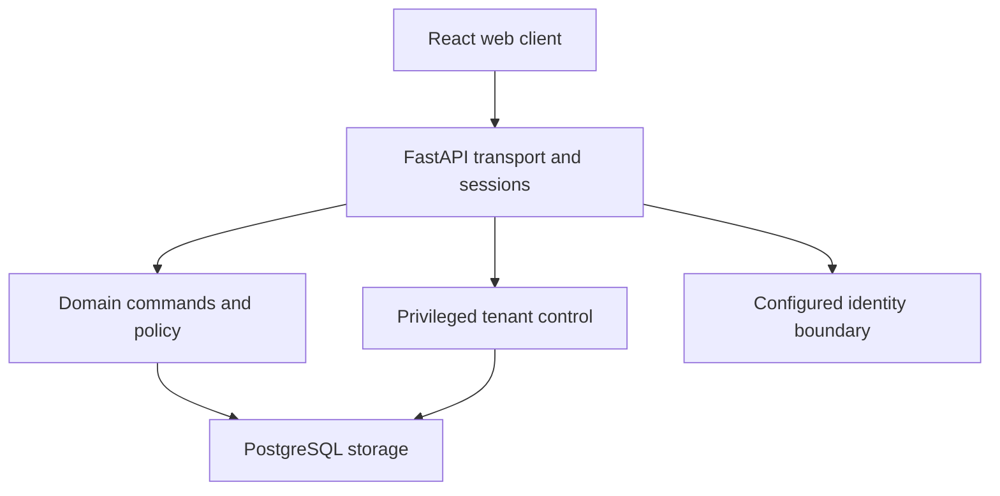
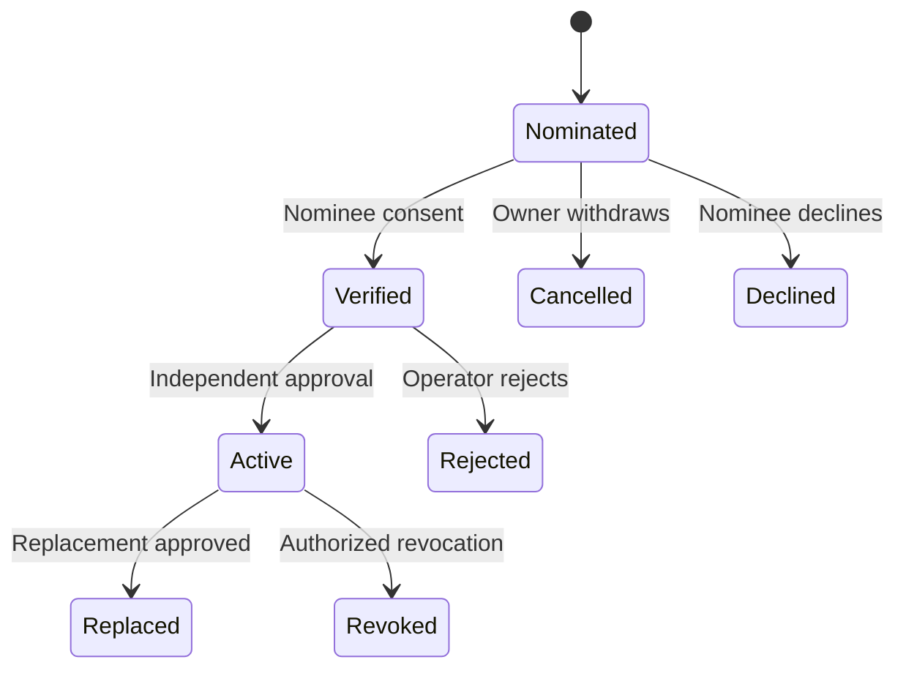

# Current Impact Platform architecture

This view describes application build 0.12.0. The original HLD and its target deployment diagrams remain in the revised HLD, explicitly distinguished from this implemented development topology.

| Component | Source | Current responsibility |
| --- | --- | --- |
| Browser shell | apps/web/src/main.tsx | Sign-in, permitted workspaces, domain records, review, results and reporting UI |
| Configuration | apps/web/src/Configuration.tsx | Programme, manual definition, plan and collection-readiness setup |
| Administration | apps/web/src/Administration.tsx and WorkspaceSettings.tsx | Membership/grant workflows, roles, groups, organisation, preferences and sessions |
| Governance | apps/web/src/PeriodGovernance.tsx and Changes.tsx | Period close, restatement and reviewed changes |
| Work centre | apps/web/src/WorkCenter.tsx | Assigned recalculation work and safe notices |
| Tenant control UI | TenantLifecycle.tsx, InitialAccess.tsx, RecoveryContacts.tsx | Custody/readiness, reviewed bootstrap and contact evidence |
| Transport and identity | apps/api/impact_api/main.py and auth.py | Request validation, session/cookie/CSRF and configured bearer identity |
| Storage and policy | apps/api/impact_api/store.py | Transaction-local context, grants/scopes, revisions, audit/outbox and receipts |
| Domain services | administration.py, workspace_administration.py, measurement.py, service.py | Explicit reviewed commands and persisted domain changes |
| Frozen outputs | period_governance.py and reporting.py | Reconciled snapshots, reports and controlled publication |
| Control plane | tenant_lifecycle.py, access_bootstrap.py, recovery_contacts.py | Separately privileged onboarding, initial authority and recovery evidence |

The configured identity boundary has a local synthetic sign-in adapter and OIDC transport support. It is not evidence of a live qualified provider. The current local storage adapter uses fresh in-memory PGlite for recorded qualification. Production database logins, concurrency, persistence and topology remain separate gates.

## Recovery relationship and transaction

The diagram summarizes principal transitions; cancel, decline and reject apply to eligible pending states as defined in the closed API contract. Eligibility is recomputed independently of stored state. Expiry or identity/custody drift can make an Active row ineligible without changing its historical state. Approval of a replacement and supersession of the previous contact occur in one transaction.

| Relationship | Integrity boundary |
| --- | --- |
| Recovery contact → managed tenant | Contact table tenant foreign key; shared tenant mutation lock |
| Recovery contact → owner and nominee | Pinned identities, current custody/profile checks and natural-person independence |
| Replacement → earlier contact | Prior contact ID and expected revision; atomic replacement and events |
| Contact proof → identity cutoff | Ordered identity/profile/cutoff locks against account-wide revocation |
| Mutation → platform event and receipt | Same database transaction; exact retry under current authority |

Current diagrams do not imply implemented queues, object stores, Android clients, AI gateways, external delivery or production monitoring. Those remain in the target architecture and acceptance plan.
