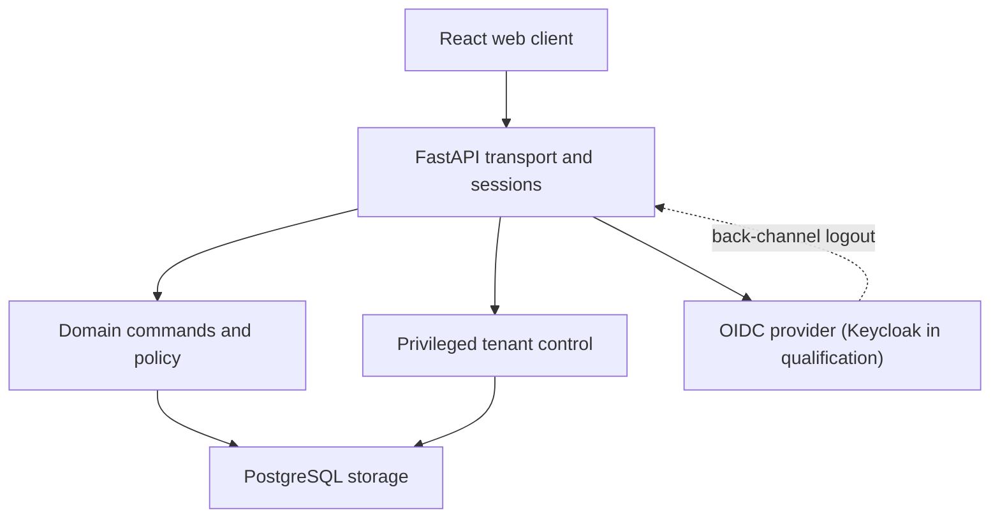
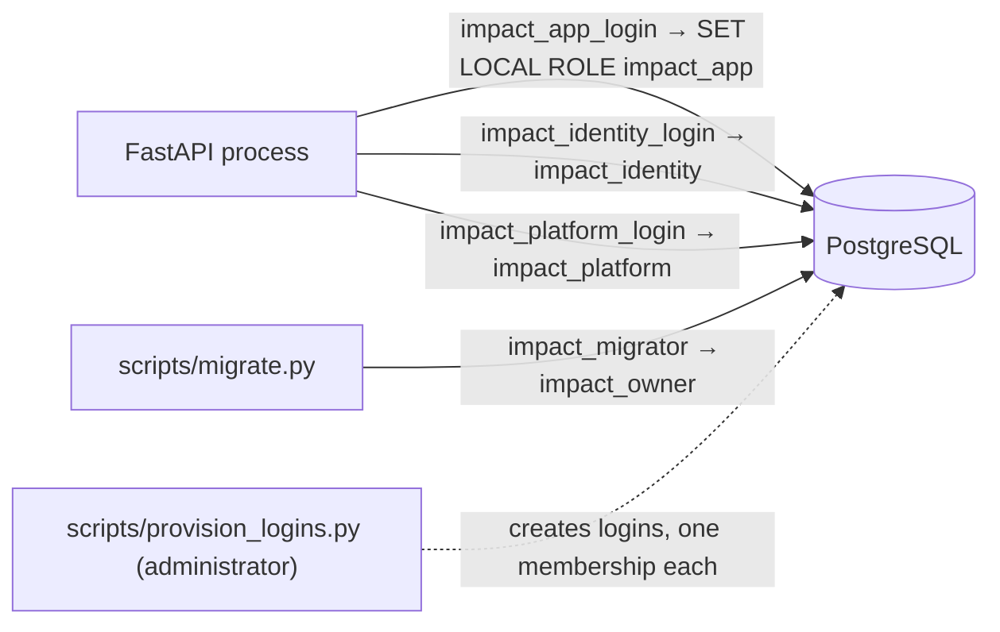
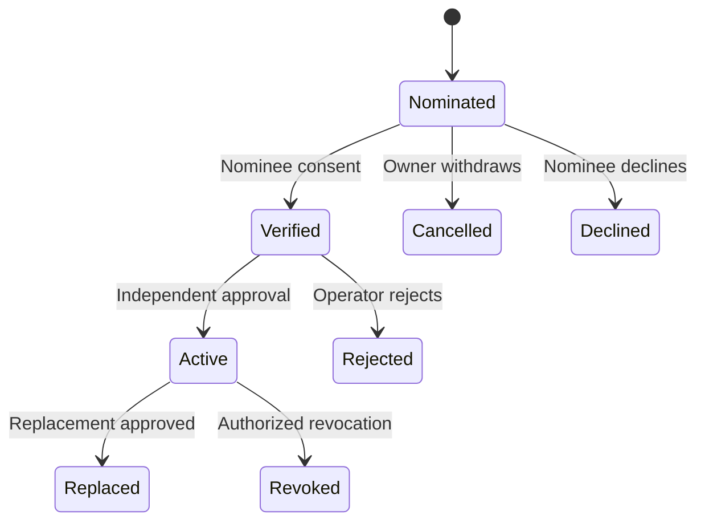

# Current Impact Platform architecture

This view describes application build 0.15.0. The original HLD and its target deployment diagrams remain in the revised HLD, explicitly distinguished from this implemented development topology.



| Component | Source | Current responsibility |
| --- | --- | --- |
| Browser shell | apps/web/src/main.tsx | Sign-in, permitted workspaces, domain records, review, results and reporting UI |
| Configuration | apps/web/src/Configuration.tsx | Programme, manual definition, plan and collection-readiness setup |
| Administration | apps/web/src/Administration.tsx and WorkspaceSettings.tsx | Membership/grant workflows, roles, groups, organisation, preferences and sessions |
| Governance | apps/web/src/PeriodGovernance.tsx and Changes.tsx | Period close, restatement and reviewed changes |
| Work centre | apps/web/src/WorkCenter.tsx | Assigned recalculation work and safe notices |
| Tenant control UI | TenantLifecycle.tsx, InitialAccess.tsx, RecoveryContacts.tsx, AuthorityRenewal.tsx | Custody/readiness, reviewed bootstrap, contact evidence and authority renewal |
| Transport and identity | apps/api/impact_api/main.py and auth.py | Request validation, session/cookie/CSRF, OIDC sign-in, RP-initiated and back-channel logout, and bearer identity through the provider JWKS |
| Operation identity (client) | apps/web/src/operations.ts | One operation identifier per pending action and payload, so retries are exact |
| Storage and policy | apps/api/impact_api/store.py | Login-topology verification, transaction-local role and tenant context, grants/scopes, revisions, audit/outbox and receipts |
| Domain services | administration.py, workspace_administration.py, measurement.py, service.py | Explicit reviewed commands and persisted domain changes |
| Frozen outputs | period_governance.py and reporting.py | Reconciled snapshots, reports and controlled publication |
| Control plane | tenant_lifecycle.py, access_bootstrap.py, recovery_contacts.py, authority_renewal.py | Separately privileged onboarding, initial authority, recovery evidence and reviewed authority renewal |

The identity boundary has a loopback-only synthetic sign-in adapter for development and the OIDC relying party, which since build 0.15.0 is qualified against a live Keycloak 26.7.4 started per run in development mode (see "Sign-in and logout" below); that is not evidence for the provider the owner will choose. Recorded qualification runs on fresh in-memory PGlite and, since build 0.14.0, on native PostgreSQL with separately provisioned login roles; a connection pooler, persistence across a database restart, hosting and production topology remain separate gates.

## Sign-in and logout

```mermaid
sequenceDiagram
    participant B as Browser
    participant A as Platform API
    participant P as OIDC provider
    B->>A: GET /auth/login
    A->>A: store one-use state (PKCE verifier, nonce); set impact_oidc binding cookie
    A-->>B: 302 to authorize (S256 challenge, state, nonce, max_age=0, acr_values)
    B->>P: password, then TOTP (step-up to the required ACR)
    P-->>B: 302 /auth/callback?code&state
    B->>A: GET /auth/callback
    A->>A: consume state (committed before the exchange)
    A->>P: token exchange with code_verifier (no transaction open)
    P-->>A: ID token (access or refresh token discarded unread)
    A->>A: verify signature, iss, aud, nonce, sid, auth_time; create web_session with provider auth_time, ACR, sid and sealed hint
    A-->>B: session cookie
    B->>A: POST /auth/logout
    A->>A: revoke session; unseal id_token_hint with the cookie
    A-->>B: logout_url
    B->>P: end-session with id_token_hint
    P-->>B: 302 to the platform front page
    P->>A: POST /auth/backchannel-logout (logout token) when a provider session ends elsewhere
    A->>A: verify token, record issuer+jti once, revoke sessions with that sid
```

Fresh assurance is judged from the session's stored provider `auth_time` and ACR, never from token issuance. Bearer requests are verified through the provider JWKS (issuer, audience, authorised party, expiry, `auth_time` rules and `typ: Bearer`); bearer tokens are not tied to a platform session, so they stay valid until `exp` after a logout. The sealed hint (`web_session.provider_logout_hint`, AES-256-GCM under a key derived from the cookie secret and the cookie value) and the provider session identifier (`provider_sid`) were added by migration 0017, together with the `oidc_logout_token` replay register used only by the identity role. The platform holds no provider access or refresh token.

## Database access

The API opens three kinds of connection, each on its own login when the platform runs natively: `impact_app_login` for domain requests, `impact_identity_login` for identity tables and `impact_platform_login` for the control plane. Each login is NOINHERIT and NOBYPASSRLS and is a member of exactly one NOLOGIN privilege role; inside every transaction the API issues `SET LOCAL ROLE impact_app|impact_identity|impact_platform`, sets `statement_timeout` and `lock_timeout`, and for tenant work sets the transaction-local `impact.tenant_id` before any tenant table is touched. Migrations run through the single runner `scripts/migrate.py` on a fourth login, `impact_migrator`, which assumes `impact_owner`; the API never holds that connection. The four logins are provisioned outside the migration set by `scripts/provision_logins.py`.

When unprivileged connections are required (`IMPACT_REQUIRE_UNPRIVILEGED_DB`, always in staging and production) `store.Database.verify_topology()` resolves the three connections before readiness and before every transaction: they must be three distinct logins, none superuser, BYPASSRLS or a member of `impact_owner`, or the request is refused with `SERVICE_UNAVAILABLE` and one of `PRIVILEGED_RUNTIME_CONNECTION`, `SHARED_RUNTIME_LOGIN` or `PLATFORM_NOT_CONFIGURED`. A verified topology is trusted for 60 seconds; a refusal is never cached. On PGlite the same code runs on one superuser session with the flag off, which is why login-role, session-contention, concurrency and restart tests are native-only.



**Native qualification (v0.14).** `scripts/run.py test --native` provisions the logins, migrates as the migrator, loads the fixture as the superuser and runs the full suite against the API on the three runtime logins; it then restarts the API and proves receipts, revisions and a cookie session survive, dumps and restores the database and verifies content, ownership, RLS, policies, functions and grants on the copy, and upgrades a populated database at the previous schema to the latest (schema 15 to 16 in v0.14, 16 to 17 in v0.15). Evidence is separate from the PGlite evidence (`docs/evidence/native-*.json`, `native-application-tests.xml`). The recorded runs used single-node PostgreSQL 16.13 (local) and 17.11 (CI) without a pooler; only the API process was restarted.

## Recovery relationship and transaction



The diagram summarizes principal transitions; cancel, decline and reject apply to eligible pending states as defined in the closed API contract. Eligibility is recomputed independently of stored state. Expiry or identity/custody drift can make an Active row ineligible without changing its historical state. Approval of a replacement and supersession of the previous contact occur in one transaction.

| Relationship | Integrity boundary |
| --- | --- |
| Recovery contact → managed tenant | Contact table tenant foreign key; shared tenant mutation lock |
| Recovery contact → owner and nominee | Pinned identities, current custody/profile checks and natural-person independence |
| Replacement → earlier contact | Prior contact ID and expected revision; atomic replacement and events |
| Contact proof → identity cutoff | Ordered identity/profile/cutoff locks against account-wide revocation |
| Mutation → platform event and receipt | Same database transaction; exact retry under current authority |

## Authority renewal transaction

```stateDiagram-v2
    [*] --> Requested: Owner proposes
    Requested --> Accepted: Second administrator confirms
    Accepted --> Applied: Independent operator approves
    Requested --> Cancelled: Owner withdraws
    Accepted --> Cancelled: Owner withdraws
    Requested --> Rejected: Operator rejects
    Accepted --> Rejected: Operator rejects
```

The proposal pins the current delegation ceilings, administrative grants and assignments of both administrators and their hash. Consent and approval recompute the hash and every readiness check; any difference fails with `AUTHORITY_CHANGED`. Approval writes new grant and membership revisions, bumps subject and policy epochs and calls the database-owned applicator, which re-verifies the request and re-dates only the pinned `grant_authority` and `member_role_assignment` rows; the platform event and receipt commit in the same transaction. The one-time bootstrap marker is read, never written.

Current diagrams do not imply implemented queues, object stores, Android clients, AI gateways, external delivery or production monitoring. Those remain in the target architecture and acceptance plan.
