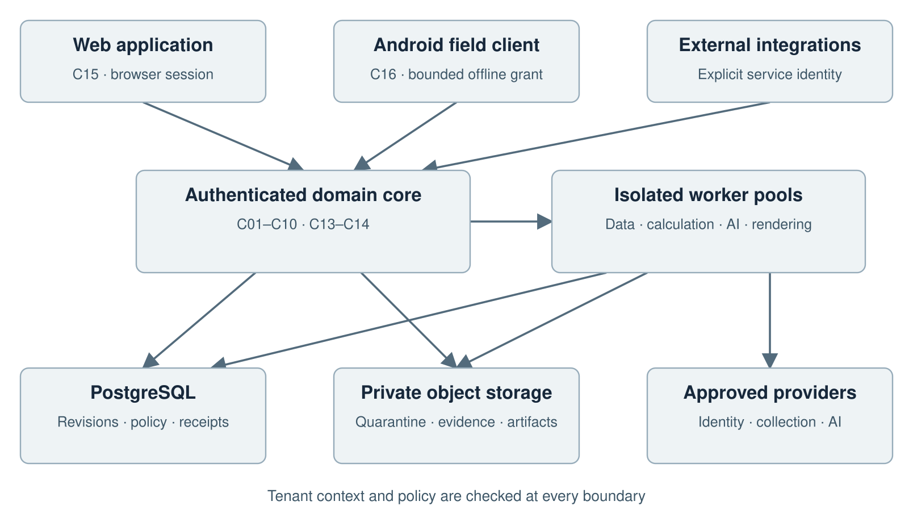
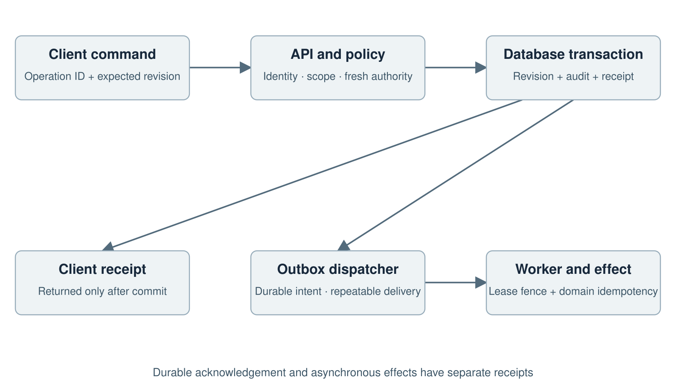

# Impact Management Platform
High Level Design

Version 1.1 | 27 September 2026 | Proposed engineering baseline

This document translates the specified scope of the saved Functional Specification Document into a proposed technical architecture. It is intended for engineering, security, data, mobile, operations and product leads. The recommended starting point is a modular transactional core with independently scalable workers, a web application and a qualified native offline client. This preserves strong governance while allowing expensive ingestion, calculation, rendering and AI work to scale separately.

The FSD remains a proposed functional baseline rather than evidence of sponsor approval or implementation. This design retains its 270 functional requirements, 37 nonfunctional contracts, release assignments and exclusions. The accompanying workbook maps every parent requirement to tests. The LLD and engineering archive make the design reviewable through interface contracts, data definitions, algorithms and executable reference tests. No capacity, availability, security certification or production readiness is claimed by this document.

## Contents

1 Authority and scope

2 Architecture decisions

3 Context and trust boundaries

4 Component responsibilities

5 Data ownership and version architecture

6 Identity and access architecture

7 Transactions and background work

8 Offline collection architecture

9 Ingestion and quality architecture

10 Measurement and analytics

11 Review snapshots and reporting

12 AI architecture and qualification

13 Privacy retention and deletion

14 Reference deployment

15 Capacity and nonfunctional budgets

16 Reliability and disaster recovery

17 Security and operational readiness

18 Migration release and exit

19 Engineering handoff and open inputs

20 Technical references

## Release interpretation

Documentation edition 1.1 is reconciled with application build 0.12.0 on 27 September 2026. The document edition and application build use different version sequences. The original business requirements and their acceptance conditions remain authoritative. No requirement has been removed or weakened to match the current code.

Build 0.13.0 increment (28 September 2026): the control-plane component list gains authority_renewal.py in the API and AuthorityRenewal.tsx in the client, mounted from TenantLifecycle.tsx. Migration 0016 adds tenant_authority_renewal and apply_authority_renewal, a SECURITY DEFINER applicator executable only by the control-plane role, which re-dates exactly the pinned delegation ceilings and administrative role assignments of an approved request; the pinned managed grants and the second administrator's membership are extended as new revisions in the same transaction under the tenant advisory lock. Application and identity roles cannot read renewals or extend authority. Edition 1.1 figures elsewhere in this document describe build 0.12.0. The Word copy is unchanged and will be regenerated at the next documentation edition.

The application is a development delivery. The requirement ledger records 74 PARTIAL and 233 PENDING requirements, with zero fully accepted. PARTIAL means a bounded implementation and some evidence exist, not that all acceptance conditions are satisfied. PENDING means the requirement has no accepted implementation coverage in the ledger; a read-only surface or reference example does not establish delivery.

Recorded qualification contains 325 application checks, 143 design-reference checks and 81 browser checks. One expired-offline-grant test is deselected and is not a pass. Local integration uses fresh in-memory PGlite PostgreSQL 17.5 with serialized transactions. Native PostgreSQL concurrency, live identity-provider assurance, disaster recovery, load qualification and production acceptance remain open.

The original BRD and FSD use R1, R2 and R3 requirement assignments. The later 16-stage delivery roadmap is an implementation sequence. Roadmap stage 1 and baseline R1 are different groupings; neither is complete. Requirement release assignments remain unchanged.

The sections explicitly marked current implementation describe this build. Retained target-design sections describe required future behavior unless the current implementation section states otherwise. Complete source, contracts, test evidence and original documents accompany this edition. Start at DOCUMENTATION-INDEX.md and TRACEABILITY.csv for exact locations and evidence boundaries.

## Current deployed development topology

The built system has a React and TypeScript web client served by one FastAPI application and a PostgreSQL-oriented persistence layer. The local runner starts a PGlite development database and the API in one process tree. It does not deploy the proposed AWS environment, external identity broker, Android client, object store, queue or AI workers. Those components remain the target architecture.

The browser uses an HttpOnly session cookie and an in-memory CSRF token. It holds no bearer token in persistent browser storage. auth.py establishes identity; store.py enforces tenant context, explicit grants, revision storage, audit, outbox and receipts. Separate domain modules implement access administration, workspace administration, measurement, period governance, reporting and personal recalculation work. The privileged tenant_lifecycle.py, access_bootstrap.py and recovery_contacts.py use the control-plane database role.

## Current trust and consistency boundaries

Ordinary application authority cannot create custody, delegation ceilings or managed-tenant recovery evidence. Identity lookup has narrow database functions. Contact approval locks identity, verified profile and authentication cutoff state against account-wide revocation. Tenant advisory locks serialize lifecycle, contact and domain mutations within the implemented paths. PGlite adds one-backend serialization, so this topology does not qualify multi-instance concurrency or throughput.

Domain writes commit head and immutable revision, audit, outbox marker and operation receipt together. Control-plane writes commit their platform event and receipt atomically. Report artifacts are frozen in database records in this implementation. There is no external dispatcher. Cancellation changes durable job and schedule state, but no worker has been qualified to interrupt real downstream effects.

## Architecture decisions requiring later qualification

The target deployment, Android, queues, managed blobs, federation, provider delivery, privacy deletion, restore replay, distributed observability and AI mediation remain requirements. Their baseline descriptions below are design contracts. Current development evidence cannot establish their effectiveness. The current schema is migration 0016; detailed table ownership and evolution are in the revised database specification and CURRENT-DATA-DICTIONARY.md.

The existing tenant write lock is a deliberate correctness-first implementation constraint. Replacing it requires tests for approval versus revision drift, revocation while waiting, replacement rollback and source consistency. Deployment-region selection, named operations owners, service identities, costs and capacity remain unresolved organizational inputs.

## Retained requirements and target design

The following baseline sections retain their requirement IDs and intended behavior. Implementation status is governed by the current profile above and the accompanying traceability register. Planned components are not represented as deployed services.

## 1 Authority and scope

The governing source is Impact Management Platform FSD version 1.0, dated 24 September 2026. Its SHA256 is 1dccf4fbe6361c5530aef5239a880d87bf440eb5a548d31a8c32ad559b10e66a. FR identifiers retain the corresponding BR suffix. VF identifiers specify the NFR verification contract. UI, D, ST, CAL and AT identifiers retain their source meanings. The package includes all R1, R2 and R3 scope; a later release capability must still satisfy every shared control when exposed.

The platform manages organisations, programmes, theories of change, indicator definitions, collection, participants where justified, data quality, evidence, independent review, approved results, dashboards, reports, analytical finance, integrations, AI assistance and controlled tenant exit. General ledger accounting, payment execution, payroll, clinical decisions and autonomous participant eligibility remain outside scope. Source system compatibility is established by authorised connector qualification, never assumed from product names.

The design is intended to improve technical quality through explicit result lineage, deterministic calculations, safe offline operation, versioned governance, scoped collaboration and controlled AI proposals. These are engineering choices, not claims about another vendor's undocumented implementation or commercial performance.

## 2 Architecture decisions

| Decision | Chosen direction | Reason and consequence |
| --- | --- | --- |
| ADR01 Application boundary | Modular Python domain core with FastAPI transport | Most governance transactions stay within one database boundary; extract services only when ownership or independent scale justifies distributed consistency cost. |
| ADR02 Web client | React and TypeScript with same-origin session boundary | Keep credentials out of browser persistent storage; use typed DTOs and accessible components across the 30 screens. |
| ADR03 Offline client | Native Kotlin Android with encrypted local persistence | Qualified device controls and reliable lifecycle integration are required for bounded offline authority. Restricted data is not enabled on unqualified devices. |
| ADR04 Authoritative store | PostgreSQL 17 compatibility baseline | Transactions, referential integrity, decimal values and forced row security support the integrity model. Pin a maintained patch during build qualification. |
| ADR05 Identity | Keycloak broker using OIDC code flow with PKCE | Federation, local recovery and MFA are identity services. Product scope, purpose, field access and independent review remain domain policy. |
| ADR06 Asynchronous delivery | Transactional outbox and at-least-once queues | Write domain state and intent atomically; consumers use durable idempotency and fencing. No exactly-once transport assumption. |
| ADR07 Data files | Private object storage with quarantine and mediated reads | Access is checked at receipt, scan, preview, export and download. Revocation cannot rely on long-lived public or signed URLs. |
| ADR08 Measurement | Versioned deterministic calculation engine | AI cannot invent official values. Decimal storage, compatibility and lineage are mandatory calculation inputs. |
| ADR09 Search | PostgreSQL metadata search initially; separate index adapter when justified | Reduce operational complexity while keeping permission filtering mandatory. A dedicated search service must prove equivalent isolation and revocation. |
| ADR10 AI | Isolated workers with scoped retrieval and typed proposal tools | Model output is untrusted. Human confirmation creates ordinary domain commands; approval, publication, grants and deletion are unavailable AI tools. |
| ADR11 Deployment | AWS reference using ECS Fargate, RDS, S3, SQS, KMS and Secrets Manager | A concrete operational design is needed for qualification. Region selection and residency approval remain deployment inputs. |
| ADR12 Tenant isolation | Shared database with forced tenant RLS plus application policy | RLS is a tenant fence, not full purpose or field authorisation. Dedicated deployment can be offered only after isolation, operations and cost qualification. |
| ADR13 Read models | Versioned approved projections and immutable snapshots | Live recalculation and historical publications have different semantics. Current privacy restrictions can withhold historic content. |
| ADR14 Operations | Structured traces and safe audit as separate data classes | Operational diagnosis must not become an ungoverned copy of participant data or credentials. |
| ADR15 Release | Compatible database changes, canary rollout and explicit rollback gates | A code rollback cannot undo a destructive data migration. Published definitions and schemas remain versioned. |
| ADR16 API contracts | OpenAPI 3.1.1 with bounded commands and semantic errors | Generated clients and contract checks reduce divergence; generated examples do not replace business invariant tests. |

## 3 Context and trust boundaries

Platform context and trust boundaries

Web users, enumerators, partner integrations and operators are separate principal classes. They cross an authenticated ingress boundary before reaching tenant-aware application handlers. An anonymous published form is a separately qualified restricted context; it never inherits ordinary tenant membership or permission to enumerate participants.

The web session terminates at the application boundary. The API derives the authenticated subject and verified tenant membership; client claims about actor, approval, scan status or commercial status do not establish authority. Native and service clients use explicitly scoped tokens and device or service identity controls. The operator plane exposes service metadata by default and does not grant routine access to customer content.

External collection providers, identity providers, email, BI and AI models are dependencies outside the core trust boundary. Every connector has a destination allowlist, scope, owner, secret reference, mapping version and failure contract. Files and retrieved text are untrusted content. Their instructions cannot change tool permissions or override platform rules.

## 4 Component responsibilities

| Component | Owned function | Package |
| --- | --- | --- |
| C01 Identity | IAM · identity broker and sessions | core.identity |
| C02 Tenant and access | TEN ACC SEC · membership, policy, support | core.access |
| C03 Planning | PLN PRG · programme, framework, work and risks | core.planning |
| C04 Measurement | IND CAL · definitions, periods, targets, deterministic results | core.measurement |
| C05 Collection | FRM OFF PAR · forms, assignments, participants, sync | core.collection |
| C06 Data and quality | DAT DQ MIG · ingestion, lineage, quality and migration | core.data |
| C07 Evidence and evaluation | EVD EVA · files, verification, qualitative findings | core.evidence |
| C08 Workflow | WFL · decisions, close, collaboration and notifications | core.workflow |
| C09 Reporting | ANA RPT · dashboards, snapshots, reports and delivery | core.reporting |
| C10 Finance | FIN · analytical funding, budgets, rates, allocations | core.finance |
| C11 Integrations | INT · source adapters, checkpoints and external delivery | workers.connectors |
| C12 AI | AI · scoped retrieval, typed proposals and evaluation | workers.ai |
| C13 Privacy | PRV · purpose, retention, holds and deletion | core.privacy |
| C14 Operations | OPS · entitlements, jobs, diagnostics, custody and exit | core.operations |
| C15 Web | UX · accessible browser application | web |
| C16 Android | OFF UX · qualified local collection and synchronisation | field.android |

The modules have separate packages, command handlers, query handlers, repositories and public ports. A module may call another module's defined port; it may not update that module's tables directly. The composition root owns transaction coordination for commands that require multiple modules. Outbox events are used for downstream work that can be eventual, while approval, head revision movement and an ordinary save remain transactional.

C01 and C02 establish identity and effective authority. C03 owns programme planning and operational work. C04 owns measurement contracts and official arithmetic. C05 and C06 move field and external source data into validated versioned records. C07 and C08 preserve evidence and decisions. C09 renders governed views. C10 records analytical financial relationships. C11–C14 handle integration, AI, privacy and operations without bypassing domain ownership. C15 and C16 implement the web and field interactions.

## 5 Data ownership and version architecture

Every tenant object has a registry identity, immutable revisions and a current projection. A projection can be replaced transactionally for efficient queries while immutable candidate revisions remain reviewable. Approval identifies object, candidate revision, workflow version, decision actor and evidence revisions. Updating the current projection never moves a previous approval to new content.

Tenant identity is part of every primary and foreign key across tenant data. UUIDs are opaque identifiers, not authorisation controls. Raw source receipts, normalised observations, calculated results, snapshots and published artifacts are separate entities with explicit lineage edges. The same source reaching a parent through multiple graph paths must not produce duplicate contribution unless the approved combination rule explicitly allows that interpretation.

Direct participant identifiers are separated from ordinary analytical attributes and are optional. Pseudonyms are scoped to their programme purpose. Identity linkage requires a reviewed matching process, with uncertainty and reversibility where applicable. A household is not automatically a person, and aggregate totals do not imply matchable unique individuals.

Storage includes private blobs, relational data, search projections, export derivatives, AI indexes and backup copies. The privacy inventory names each store and its owner. Revision immutability prevents casual rewriting; it does not justify keeping prohibited personal payloads forever. Authorised privacy execution may remove or restrict payloads while retaining the minimum lawful record of the revision and deletion action.

## 6 Identity and access architecture

Identity keys combine issuer and provider subject. Matching email addresses never merge accounts automatically. Verified natural-person reconciliation supports separation of duties across aliases without exposing identity links to ordinary users. Federation and group provisioning are distinct contracts; SCIM is R2, and directory revocation timing begins when the platform receives the change.

Effective access is the intersection of active identity, active membership, capability, explicit scope, classification, purpose, time bounds and assurance. Explicit deny and unavailable policy fail closed. Ownership is an assignment rather than an access bypass. Entitlements control paid feature availability and limits; they do not substitute for data permission or control deletion state.

Positive policy decisions may be cached for at most 30 seconds with subject and policy epochs. Revocation increments epochs transactionally, invalidates caches and terminates relevant sessions. Every online route must enforce the FSD maximum 60-second revocation bound, including search, generated artifacts, AI context and download streams. Sensitive commands also check fresh authority immediately before their effect, so the propagation allowance does not authorise stale execution.

Sessions have eight-hour absolute and 30-minute idle limits; privileged administration uses 15-minute idle and sensitive actions require assurance within five minutes. The same-origin cookie is Secure, HttpOnly, host-only and protected against CSRF. Service credentials default to 90-day expiry, require human owner and backup owner, and permit no more than 24 hours of overlap during rotation. Invitations expire after seven days, are single use and are revoked by resend.

Support requests name exact scope, capabilities, reason and expiry no later than 60 minutes. A distinct eligible approver authorises the request. Support access reuses ordinary data policies and records real and effective actor. A platform operator cannot approve their own support elevation or quietly use database superuser access as a product workflow.

## 7 Transactions and background work

Command acknowledgement and asynchronous work

A command authenticates, establishes tenant context, validates typed input, evaluates policy, locks the relevant heads, checks expected revisions and applies its state transition. The transaction includes the new revision, projection update, operation receipt, audit event and outbox intent. Only after durable commit may the API issue a successful business receipt. A client timeout is an unknown outcome resolved through operation identity, not permission to send a new logical command.

The operation key contains tenant, actor, command type and operation ID. Identical intent returns the earlier receipt after current access checks; changed intent returns CONFLICT_OPERATION. Interactive receipts remain queryable for at least seven days. Submission identity and source business keys persist for their record retention lifetime so a retry months later cannot become a second achievement merely because the interactive receipt expired.

Workers acquire generation-numbered leases. A stale worker must fail its fenced update even if it wakes after a newer worker completed the job. Acknowledgement follows committed work. Queues can duplicate or reorder events; consumer receipts and domain uniqueness constraints prevent duplicate effects. Provider-side uncertainty remains explicit until reconciled. Internal success and external delivery acknowledgement are separate outcomes.

Each tenant initially admits two active bulk jobs and two active AI jobs, with 20 queued per class. Ordinary record work has a separate path. Large jobs have bounded item batches, fairness scheduling, cancellation boundaries and progress denominators. A cancellation stops new effects at the acknowledged boundary and returns the already committed outcome manifest; it does not erase accepted records.

## 8 Offline collection architecture

The Android client stores only assigned, permitted data in an encrypted local database. The encryption key is protected through qualified device controls and Android Keystore. Keystore alone does not prove enforceable expiry, safe device state or resistance to clock rollback. Device registration, supported OS profiles, local lock behaviour and account separation require explicit qualification.

An offline grant binds tenant, authenticated identity, device public key, assignment scope, form versions, policy epoch, allowed actions and expiry. Ordinary packages expire within 24 hours; restricted participant packages expire within eight hours and require approved managed devices. The client anchors a server-verified time to monotonic elapsed time. If reboot or local state loss prevents trusted continuity, the restricted package locks until online renewal. Wall-clock changes do not extend a lease.

Offline revocation cannot immediately reach a disconnected device. That residual window is bounded by the already issued lease and disclosed in policy. Reconnection checks current revocation before reading or uploading protected data. Remote wipe is best effort. Unsupported secure expiry disables sensitive offline use, rather than presenting a misleading compliant checkbox.

Local drafts, uploaded media, server receipt, validation and approval are separate states. A stable submission ID survives app restarts and every retry. The server retains original author and authenticating uploader separately. Conflicts preserve the user's draft and display permitted differences; no governed correction uses silent last-write wins. A required missing attachment leaves evidence incomplete and prevents approval.

## 9 Ingestion and quality architecture

Source receipt first creates a bounded upload session and quarantined blob. The pipeline checks declared and actual type, byte count, digest, malware profile and permitted extraction. R1 excludes executable and macro-enabled files. Source imports accept up to 100 MB, media up to 25 MB, in decimal units. Encrypted unscannable files cannot reach ordinary preview or satisfy evidence requirements.

An import preview binds source digest, mapping version, locale, date grammar, stable business-key policy, controlled replacement scope, mode and expected control totals. Confirmation expires after 30 minutes or a material change, whichever comes first. Mapping changes do not silently reinterpret historical observations. Raw receipt and transformation versions remain reconstructable within lawful retention.

Partial imports record one terminal outcome per parsed data row: inserted, revised, unchanged duplicate, rejected, quarantined or unprocessed. Header and deliberately skipped nondata lines are separate counts. Atomic imports commit no business records if the batch fails. A parse failure before reliable row boundaries is a file failure with last safe location, not an invented total.

Quality issues bind rule version and affected revision. Revalidation demonstrates correction. Only eligible warnings can be excepted under approved scope, reason and expiry; security, invalid arithmetic and independent review cannot be waived. Source schema drift pauses affected mappings and produces an actionable diagnostic instead of corrupting downstream results.

## 10 Measurement and analytics

The engine receives approved definition, unit, population, inclusion, exclusion, source version, period, dimensions and rule version. It returns typed value state, full-precision stored decimal, display rule, lineage, coverage, freshness and limitations. Official and provisional modes are distinct in API responses, screens and exports. No pending submission enters official totals merely because its ingestion succeeded.

Source and stored numeric fields use NUMERIC(38,12), decimal strings at transport boundaries and intermediate precision of at least 50 decimal digits. Overflow or unsupported scale fails explicitly. Display rounds half up at the declared output boundary, with zero to six display decimals. Three values of 0.335 sum to 1.005 before displaying 1.01. Separate rounding of each input would be incorrect.

Pooled percentages preserve numerators and denominators: 50/100 plus 1/10 produces 51/110, displaying 46.36%, rather than 30%. Cumulative positions use the final position and permit increments only with a verified starting point. Unique reach uses authorised identity sets; unknown overlap remains unknown. Medians require compatible raw values or a specifically approved approximation. Graph cycles and ambiguous duplicate contribution are blocked.

Calendars and dimension sets are versioned. Periods include start and exclude end, with programme reporting zone and event instant retained. Similar labels do not prove compatible populations, age bands or units. Targets retain original and revised versions. A locked actual of 900 against 1000 remains 90%; an approved revised comparison against 800 is separately labelled 112.5%.

Analytical finance uses stable transaction identity, source currency, reporting currency, dated rate version, allocation basis and residual distribution. A reversal is a linked correcting transaction. Cost per outcome states eligible cost exclusions and denominator meaning; it cannot imply causal return on investment without supporting methodology.

## 11 Review snapshots and reporting

The workflow engine maintains candidate authors, eligible reviewers, mandatory stages, optional quorum, delegation and exact revision bindings. Verified natural identity prevents group or alias self approval. Returned or materially edited candidates require fresh decisions. Absence of an eligible reviewer creates a blocked reassignment task; timeout never approves automatically.

Period close takes a consistent readiness manifest. All mandatory obligations must be approved, mandatory evidence complete and blocking issues resolved. The close transaction verifies that the readiness inputs have not changed, freezes definition, target, result and evidence references, and records the immutable snapshot. Optional missing work remains explicitly disclosed. A restatement is a separately approved new snapshot and publication sequence.

Report templates bind numeric fields to result references and reconcile every official number before approval. Narrative editing cannot override an official value. Generated artifacts include source mode, snapshot identity, audience, language, caveats and template version. Publication validates current audience and restrictions. A frozen number stays frozen after live recalculation, while a privacy decision may make its underlying component unavailable.

Public disclosure is off by default. A minimum positive cell size of five is an initial rule, not proof of anonymity. The release process considers complementary suppression, totals, filters and prior released slices. A cell of two can be reconstructed from eight and ten even if the cell itself is hidden. Approved public artifacts contain only the reviewed transformed output and confer no access to private sources.

## 12 AI architecture and qualification

AI workers run in a separate egress and resource boundary. Retrieval starts with authorised source IDs and permitted fields; snippets, embeddings and cached answers carry the same tenant, purpose and restriction metadata as their sources. Provider region, retention and content handling are approved inputs. An unavailable provider does not trigger an unreviewed vendor fallback.

Models may classify, extract, suggest mappings, draft narratives, explain sources and prepare permitted changes. The output is a typed draft with cited source revisions, limitations and provenance. Official numbers come from deterministic tools. A model cannot approve its own proposal, publish a report, grant a capability or delete data. Retrieved instructions are treated as source content rather than tool authority.

A write proposal includes target object, expected revision, exact before/after diff, source revisions, policy context, expiry and a canonical proposal digest. Human confirmation revalidates every dependency before creating an ordinary command. Changed source or target content marks the proposal stale; the engine does not silently rebase a user's approval onto new content.

Each enabled use case requires the FSD held-out evaluation set and released language/sector coverage. At least 200 representative cases are expected where feasible, with at least 20% boundary, unsupported or adversarial cases. Supported claims, citation correctness, extraction precision/recall and abstention have separate gates. Any observed tenant leak, secret disclosure or unauthorised tool action blocks the affected capability regardless of its average quality score.

## 13 Privacy retention and deletion

Collection is gated on approved record and evidence retention. Diagnostic logs default to no more than 90 days, AI prompt/response content to no more than 30 days and security event metadata to 365 days, unless the applicable FSD rule permits a justified exception. Longer business audit retention follows tenant policy. Retention is not replaced by an invented universal legal schedule.

A privacy case separates requester verification, assessment, authority, approved scope, holds, execution and external follow-up. Once authorised deletion is executable and no hold applies, active stores must remove or effectively restrict affected content within 24 hours. The plan covers primary records, files, caches, indexes, exports, derived reports and AI content. Completion is per store; a failed derivative cleanup cannot be hidden behind a completed primary delete.

Backups normally expire within 35 days. Restoring an older backup occurs behind a closed access boundary. A durable deletion ledger and current grant state are reapplied before users, workers, search or AI can query restored content. The ledger and keys must be available independently of the stale restored copy. External recipients receive tracked instructions according to policy; the platform cannot claim it has recalled bytes already delivered outside its control.

## 14 Reference deployment

Use separate production and nonproduction accounts, private application/database subnets across qualified availability zones, managed certificates and a controlled ingress gateway. ECS services run API, calculation, ingestion, rendering, connector, AI and privacy worker pools separately. RDS provides the transactional database and qualified backup/failover configuration. S3 stores private blobs and artifacts. SQS provides delivery and dead-letter queues; KMS and Secrets Manager own keys and credentials.

The proposed initial allocation is four API tasks with two vCPU and 4 GB each; two calculation tasks with four vCPU and 8 GB each; and two ingestion tasks with four vCPU and 8 GB each. Other worker pools have independent budgets and scaling. These are starting hypotheses for load qualification, not a benchmark, procurement commitment or cost estimate. Database size, IOPS, connection pools and storage throughput must be measured against the actual data distribution.

Egress is denied by default except for approved provider destinations. Runtime credentials are scoped by task role. Databases and object stores have no public application access. Deployments pin image digests and configuration versions, generate software bills of materials, and separate build authority from production deployment authority. Tenant-specific configuration remains data; routine customer changes do not create code forks.

## 15 Capacity and nonfunctional budgets

The qualification profile contains 250 tenants, 20 simultaneously active tenants, 1000 concurrent users, a 250-user largest cohort, 100 million observations overall, 20 million in the largest tenant, 10000 projects and 200000 indicator instances. One business operation per user per five seconds gives 200 operations per second; the burst target is 400 operations per second for five minutes. Run a 60-minute peak and eight-hour soak with background jobs.

The proposed mix is 50% ordinary reads, 20% dashboards, 15% writes, 10% search and 5% approvals. Record end-to-end action completion, queue time and errors by action class and material tenant cohort. Cold and warm caches are different populations. Fast validation failures do not count as successful latency samples. A rough 2 KB raw observation assumption yields 200 GB for 100 million rows before indexes, revisions, replicas and attachments; actual storage and cost require measurement.

| FSD contract | Required target |
| --- | --- |
| VF-PER-001; Interactive response | Under the standard workload, ordinary record reads, list views with up to 100 returned rows, saves and approval actions shall complete at p95 within 2 seconds and p99 within 5 seconds measured from user action to usable confirmed response. Long jobs are excluded only if explicitly routed asynchronously. |
| VF-PER-002; Dashboard response | A standard dashboard of up to ten widgets with approved bounded calculations shall become usable at p95 within 5 seconds and p99 within 10 seconds. Cached and uncached results shall be reported separately. Freshness and calculation status shall remain visible. |
| VF-PER-003; Search response | Permission filtered metadata and indexed document searches shall return the first 50 results at p95 within 3 seconds and p99 within 8 seconds under the standard profile. Empty, restricted and multilingual searches shall follow the same confidentiality rules. |
| VF-PER-004; Import and recalculation throughput | A standard import of 100000 rows and 30 simple fields with configured deterministic checks shall complete validation and ingestion at p95 within 10 minutes, excluding human approval and external source transfer. A resulting bounded 1000 indicator recalculation shall complete within 5 additional minutes at p95. |
| VF-PER-005; Export and report generation | A standard 100000 row data export or 50 page report with up to 20 charts shall complete at p95 within 5 minutes. Jobs shall acknowledge receipt within 2 seconds, expose progress and support cancellation. Larger jobs shall show estimated class and explicit limits. |
| VF-PER-006; Data freshness | After a submission is approved and its bounded calculation finishes, live dashboards shall reflect the new approved result within 60 seconds at p95. External source cadence and human review delays shall be displayed separately rather than hidden in this metric. |
| VF-PER-007; AI responsiveness | For interactive evidence questions, the system shall acknowledge within 2 seconds and target a first useful response at p95 within 15 seconds and a completed standard answer within 45 seconds. Long extraction and reporting tasks shall use visible asynchronous jobs with cancellation and a declared timeout. |
| VF-CAP-001; Supported object limits | The baseline shall qualify forms with 200 questions and 100 repeat entries, source files up to 100 MB, media files up to 25 MB and import jobs up to one million rows through an appropriate asynchronous path. Limits and supported combinations shall be visible before work begins. |
| VF-CAP-002; Scaling and workload isolation | The service shall admit, queue or limit work predictably as demand rises. A large tenant import or AI job shall not cause unrelated tenants to miss core service targets during the baseline workload. Bursts shall recover without unbounded queues. |
| VF-AVL-001; Core availability | The internal core service objective shall be at least 99.9 percent monthly availability for supported authentication, record access, submission, approval and access to published reports. Measure each critical journey and material tenant cohort. Planned maintenance affecting these journeys counts against this internal objective. |
| VF-AVL-002; Dependency degradation | AI, email, external data collection and BI failures shall be isolated where possible. Users shall see the affected function, stale data and queued actions. Core manual workflows shall remain available when their independent dependencies are healthy. |
| VF-DR-001; Disaster recovery | For the standard qualified deployment, catastrophic recovery shall target a recovery point objective of at most 15 minutes and recovery time objective of at most 4 hours from incident declaration. Recovery shall occur only within permitted regions and include files, configuration and governance state. |
| VF-DR-002; Ordinary failure durability | A server acknowledgement of a saved record shall represent durable acceptance under the qualified ordinary single component failure model. Offline local saves shall be clearly distinct. Catastrophic recovery exposure remains governed by NFR-DR-001. |
| VF-DR-003; Recovery testing and backups | Backups shall be protected against unauthorised alteration and credential compromise. Representative restores shall be tested monthly and disaster recovery at least quarterly. Default backup retention shall be no more than 35 days unless an approved contract or hold requires a different schedule. |
| VF-DIN-001; Calculation correctness | The entire approved deterministic golden corpus shall pass exactly at the defined precision before release. It shall cover pooled ratios, distinct counts, period semantics, dimensions, corrections, rounding, missingness, cycles and permissions. There shall be zero unexplained official report reconciliation differences. |
| VF-DIN-002; Concurrent change integrity | Concurrent edits and retries shall not silently lose updates, duplicate achievements or approve stale versions. Business transactions shall either complete with recorded effects or return a recoverable explicit partial outcome where the operation permits one. |
| VF-IAM-001; Revocation time | Online user suspension, permission removal and credential revocation shall take effect within 60 seconds across user interfaces, APIs, generated downloads, search and AI access. Queued jobs shall reauthorise before sensitive action. Directory initiated revocation is measured from receipt by the platform. |
| VF-OFF-001; Offline authority window | Default offline packages shall expire within 24 hours without renewed authorisation. Restricted participant packages shall default to at most 8 hours and require approved device controls. Longer low sensitivity windows require a recorded risk exception; sensitive data may be prohibited from offline use entirely. |
| VF-SEC-001; Release security threshold | All applicable baseline security controls shall have passing evidence. No unresolved critical or high vulnerability affecting confidentiality, integrity or access shall enter production without an effective verified mitigation. Functional parity shall not override this gate. |
| VF-SEC-002; Incident and remediation timing | For critical production incidents, on call acknowledgement shall occur within 15 minutes and containment work shall begin within 30 minutes. Confirmed critical vulnerabilities require mitigation within 24 hours and a permanent fix target within 72 hours; high vulnerabilities within 7 days. Legal and contractual notices follow the approved incident policy. |
| VF-AUD-001; Audit coverage and retention | All defined security and business audit event classes shall be captured and searchable by authorised reviewers. Default security event metadata retention shall be 365 days; longer business audit retention shall follow tenant policy. Secret values and unnecessary personal payloads shall not be logged. |
| VF-PRV-001; Deletion propagation | After an authorised deletion becomes executable and no hold applies, active primary records, caches, indexes and platform generated derivatives shall be removed or effectively restricted within 24 hours. Backup expiry follows the approved schedule, normally within 35 days. External recipient actions shall be tracked separately. |
| VF-PRV-002; Retention defaults and proof | Production tenants shall have approved record and evidence retention policies before collection. Diagnostic logs shall default to 90 days or less; retained AI prompt and response content shall default to 30 days or less unless a justified policy specifies otherwise. Minimal governed approval evidence may have a separate schedule. |
| VF-AIQ-001; Evaluation set quality | Each enabled use case shall have a held out evaluation set with at least 200 representative cases where feasible, including at least 20 percent boundary, unsupported or adversarial cases. Small specialist sets require documented justification and risk review. Each released language and sector must have explicit coverage evidence. |
| VF-AIQ-002; Evidence and numeric accuracy | Evidence question answering shall achieve at least 95 percent supported factual claims and at least 98 percent correct citation locations on the approved set. Every numeric value presented as an official result shall match the authoritative tool result. A critical unsupported consequential claim blocks release regardless of the average score. |
| VF-AIQ-003; Extraction and abstention | Document extraction shall target at least 95 percent field level precision and 90 percent recall on mandatory fields. The system shall correctly abstain or request clarification for at least 95 percent of designated unanswerable cases, while incorrect abstention on answerable cases remains at or below 10 percent. |
| VF-AIQ-004; Leakage and action safety | Adversarial qualification shall show zero successful cross tenant disclosures, unauthorised tool actions or secret disclosures in the defined test suite. This is a test acceptance criterion, not proof that real world risk is zero. Any observed failure blocks the affected capability until resolved. |
| VF-AIQ-005; Change monitoring and rollback | Model, prompt, retrieval and policy changes shall have versioned evaluation, controlled rollout and rollback. Production monitoring shall track failures, reviewer corrections, refusals, latency, cost and language specific quality with minimised content retention. |
| VF-UX-001; Accessibility conformance | All supported core journeys shall meet WCAG 2.2 Level AA through automated checks and manual keyboard and assistive technology review. Complete processes, third party authentication flows under product control and generated standard templates shall be included in the scope. |
| VF-UX-002; Usability qualification | At least 90 percent of representative users shall complete programme setup, assigned collection, correction, approval, result explanation and report generation tasks without facilitator intervention after standard onboarding. No observed critical data loss or disclosure error is acceptable. |
| VF-CMP-001; Browser and device support | The product shall qualify current and previous major versions of Chrome, Edge, Firefox and Safari at release, with stated mobile OS and client support. Browser changes shall trigger regression checks. Unsupported environments shall receive clear guidance rather than silent data corruption. |
| VF-L10-001; Localisation integrity | Unicode, locale specific number and date handling and explicit time zones shall survive ingestion, search, calculations and export. Released translations shall cover all blocking workflow text. Display locale shall not change stored values or period assignment. |
| VF-MNT-001; Maintainable contracts | Business rules, supported APIs, configurable policies and data dictionaries shall be documented and version controlled. Changes shall retain traceability to requirements and tests. Routine tenant configuration shall not require a customer specific code fork. |
| VF-OBS-001; Operational diagnosability | Failures shall have correlation references linking user actions, background jobs and integration events without exposing secrets. Critical service failure alerts shall be generated within 5 minutes of detection conditions. Logs shall support tenant scoped diagnosis and audit separation. |
| VF-PRT-001; Portability and exit quality | Tenant exports shall include a documented manifest and machine readable relationships. A standard tenant with up to one million structured rows and 10 GB of attachments shall receive a complete asynchronous package within 24 hours under the agreed service process. Larger exports require a visible estimate and progress. |
| VF-ECO-001; Cost transparency and sustainability | The operating model shall measure cost per active tenant, approved result workload, storage volume, integration run and AI use case. Product limits shall be costed against the qualification profile. A cost budget shall be approved before offering unbounded or dedicated deployment commitments. |
| VF-SUP-001; Support and service readiness | Critical incident response shall have continuous on call coverage. Normal support hours, response targets and escalation channels shall be published for each service plan. An operational owner, runbook and tested recovery path shall exist for every critical capability. |

## 16 Reliability and disaster recovery

The core availability objective is at least 99.9% monthly for authentication, record access, submission, approval and published report access. Planned maintenance affecting those journeys counts against the internal objective. Each journey and material cohort is measured; a healthy service-wide average cannot conceal an unavailable tenant. Define synthetic probes that prove usable outcomes without generating production personal data.

Ordinary acknowledged writes must survive the qualified single-component failure model. Catastrophic recovery instead uses RPO no more than 15 minutes and RTO no more than four hours from incident declaration. Qualify database, attachment, configuration, governance and key recovery together. Monthly representative restores and quarterly disaster exercises prove the recovery process, not merely the existence of backup files.

Only policy-permitted regions may host recovery. If no permitted secondary region or equivalent recovery arrangement exists, the deployment cannot claim regional disaster compliance. Fail AI, email and external connectors independently to verify that healthy manual workflows continue. Where a dependency is genuinely required, report the affected journey and cohort instead of claiming blanket isolation.

## 17 Security and operational readiness

The threat model covers identity takeover, tenant confusion, stale permissions, privilege escalation, self approval, source tampering, file attacks, outbound request abuse, disconnected device exposure, inference from aggregates, prompt injection, backup resurrection and operator misuse. Map applicable ASVS 5.0 Level 2 controls, including Level 1, to scoped evidence. This is a verification target, not a claim of certification.

Critical service failure alerts must be generated within five minutes of detection conditions. Critical incidents require acknowledgement within 15 minutes and containment work beginning within 30 minutes. Confirmed critical vulnerabilities require mitigation within 24 hours and a permanent fix target within 72 hours; high findings within seven days. Record accountable response, escalation and effective protection rather than equating a sent alert with a response.

Structured diagnostic records contain correlation ID, tenant-safe reference, action class, stage, outcome and latency, with secrets and unnecessary personal content excluded. Business audit events are separately governed and include restricted reads, denied commands, decisions, publication, support and privacy actions. Tamper evidence uses ordered batches and independently retained signed checkpoints; a hash chain stored only beside the editable source is insufficient.

Every critical capability needs an owner, on-call route, runbook, rollback or recovery action and tested degraded state. Release blockers include unmitigated critical/high access, confidentiality or integrity findings; unexplained official-number differences; failed tenant isolation; lost acknowledged writes; stale approvals; and unqualified sensitive offline expiry.

## 18 Migration release and exit

Migration begins with an authorised source inventory and immutable receipt. Dry runs map source identifiers, values, attachments, version semantics and governance evidence into an isolated tenant. Reconcile counts, distinct business identities, decimal control totals, attachments and unsupported fields. Imported historic approval claims are labelled with available provenance; the platform never fabricates a decision actor or missing audit history.

Database changes use expand, backfill, switch and contract phases. Backfills are tenant-scoped, resumable and idempotent. New code accepts the overlap of supported schema versions during rollout. Destructive contraction waits until old clients, workers and rollback windows are closed. Configuration promotion contains synthetic fixtures and version references, never implicit production credentials or participant copies.

Tenant export contains machine-readable records, relationships, schemas, code lists, source lineage, lawful decision metadata, attachments and checksums. An independent importer must reconstruct the authorised scope. The standard one-million-row and 10 GB attachment package has a 24-hour service target; larger tenants receive visible estimates. Closure checks custody, outstanding jobs, contractual retrieval window, holds and deletion plan before irreversible actions.

## 19 Engineering handoff and open inputs

R1 begins with identity, tenancy, revision/receipt infrastructure, audit and policy enforcement before collection or reporting. A vertical slice then proves programme definition, submission, independent review, deterministic calculation, period lock and report publication. Import, file safety and offline sync follow under the same contracts. R2 and R3 capability flags must never weaken shared security or arithmetic controls.

The LLD defines command handling, data types, lifecycle enforcement, database structures and test hooks. The archive contains a proposed OpenAPI contract, a database blueprint, fixed vectors and executable API harnesses. These are design assets requiring code generation, infrastructure implementation and qualification. Open nested payloads and blueprint migrations must be closed and tested before a production release.

Remaining deployment inputs are permitted regions and recovery topology; identity/federation policy; approved record/evidence retention; supported device profiles; released languages; qualified connector versions; AI provider/model/data handling; commercial capacity budgets; and service support plans. They are explicit inputs to baselining, not reasons to omit the architecture or leave controls implicit.

## 20 Technical references

| Ref | Contract | Source |
| --- | --- | --- |
| S01 | Functional baseline | Impact Management Platform FSD v1.0, 24 September 2026. Source digest is recorded in the companion HLD and archive README. |
| S02 | PostgreSQL row security | https://www.postgresql.org/docs/17/ddl-rowsecurity.html |
| S03 | Transactional outbox | https://docs.aws.amazon.com/prescriptive-guidance/latest/cloud-design-patterns/transactional-outbox.html |
| S04 | Queue redelivery | https://docs.aws.amazon.com/AWSSimpleQueueService/latest/SQSDeveloperGuide/standard-queues-at-least-once-delivery.html |
| S05 | OIDC identity layer | https://www.keycloak.org/securing-apps/oidc-layers |
| S06 | Android key custody | https://developer.android.com/privacy-and-security/keystore |
| S07 | OpenAPI format | https://spec.openapis.org/oas/v3.1.1.html |
| S08 | Worker boundary | https://fastapi.tiangolo.com/tutorial/background-tasks/ |
