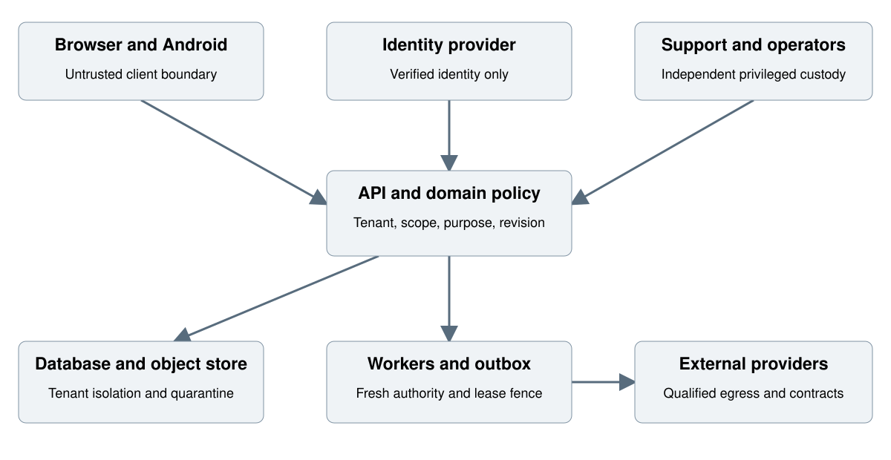

# Impact Management Security Threat Model

Version 1.1   27 September 2026

This threat model identifies how an attacker, compromised account, faulty integration or operational error could violate tenant confidentiality, participant privacy, official results or service continuity. It connects concrete abuse paths to controls, accountable engineering roles and verification. It is the design input for implementation and independent assessment, not a claim that the controls have already passed a penetration test.

## Release interpretation

Documentation edition 1.1 is reconciled with application build 0.12.0 on 27 September 2026. The document edition and application build use different version sequences. The original business requirements and their acceptance conditions remain authoritative. No requirement has been removed or weakened to match the current code.

Build 0.13.0 increment (28 September 2026): TH05, TH06 and TH07 evidence is extended by the authority-renewal negative tests in qualification/test_authority_renewal.py: nominee substitution and an ineligible or same-person second administrator (SECOND_ADMIN_UNAVAILABLE, INDEPENDENCE_REQUIRED), replay after a grant or ceiling was revoked (AUTHORITY_CHANGED, no resurrection), alias operators attempting approval (INDEPENDENCE_REQUIRED), stale assurance and account cutoffs (FRESH_MFA_REQUIRED, REAUTHENTICATION_REQUIRED), drifted tenant or owner pins, and runtime roles attempting to read or extend authority directly (42501). No penetration test, live MFA or distributed revocation test was added. The Word copy is unchanged and will be regenerated at the next documentation edition.

Build 0.14.0 increment (29 September 2026): native PostgreSQL evidence is added for three register items. TH09 (lost update or close race) gains its first concurrent-writer evidence in qualification/test_native_concurrency.py: two independent approvals of one candidate admit exactly one (CONFLICT_VERSION for the other), two close reviews of one period lock it once (PERIOD_ALREADY_SNAPSHOTTED), a renewal approval raced with a pinned-grant revocation resolves in one order or the other (CONFLICT_VERSION or AUTHORITY_CHANGED), exact and conflicting replays yield one receipt or CONFLICT_OPERATION; edit/edit, correction/close and approval/candidate-edit races are still not run. TH10 (database role or context leakage) gains real-role evidence in test_native_roles.py: each provisioned login assumes only its own privilege role, superuser/BYPASSRLS/owner-member and shared logins are refused on readiness and on every transaction, impact_app is fenced without a transaction-local tenant and cannot read control-plane tables, and the restore drill shows ownership, RLS, policies, functions and grants identical on a restored copy; pooled-connection context reset is untested because no pooler exists. TH14 (secret leakage through diagnostics) gains evidence that the API process environment holds no privileged connection string, login password or PG* variable (asserted from /proc), that topology refusals carry a reason code and never a login name, and that pg_dump/pg_restore receive the superuser password through the environment, not the command line. TH27 (backup resurrects deleted records) remains open: the drill verifies a restored copy's security posture but replays no deletion or revocation restriction before reopening. No penetration test, live MFA or distributed revocation test was added; the restore drill is CI-scale, not a backup regime. The Word copy is unchanged and will be regenerated at the next documentation edition.

Build 0.15.0 increment (29 September 2026): live-provider evidence is added for three register items. TH04 (confused identity token) is exercised against Keycloak 26.7.4 in qualification/test_live_idp.py: tokens of another issuer (a second realm of the same provider with the same client and an author user), a tampered signature, a key outside the provider JWKS, an expired token and an ID token presented as a bearer credential (typ check) are refused; an injected authorization response with another nonce, a replayed or unbound state and a wrong PKCE verifier fail; conflicting cookie and bearer identity was already refused. A stale signing key (rotation) is still not tested. TH06 (stale grant after revocation) gains session-level evidence only: logout and a verified back-channel logout revoke platform sessions at once and a replayed logout token is refused, but a bearer access token stays valid until exp (120 s in the realm), beyond the 60-second target. TH14 (secret leakage through diagnostics) gains: provider credentials are generated per run into a 0600 file and appear in no evidence, the ID token is stored only sealed under the session cookie, and logout-token refusals carry one reason code. TH30 is unchanged apart from a dead-session logout now clearing the cookie. No penetration test, provider outage or key-rotation test was run. The Word copy is unchanged and will be regenerated at the next documentation edition.

Build 0.16.0 increment (29 September 2026): TH20 (stale worker commits after takeover), previously without evidence, gains local and native evidence: every outcome update is fenced on lease owner and generation and a stale holder's completion is refused (qualification/test_worker.py), two worker processes never deliver the same row and a batch outliving its lease sends each row once (qualification/test_native_worker.py); the deduplicated-external-effect control is only partial, because a single email send that outlives a whole lease can be repeated by the next holder (shown natively) and only the stable Message-ID lets a receiver discard it. TH05 (invitation and recovery takeover) gains: invitation intents hold no token, earlier links are superseded on resend, revocation and expiry, and recovery-channel codes are derived, stored only as a keyed hash, single use, 15-minute, five-attempt and three-requests-per-hour; a compromised worker or its configuration can still mint links for existing invitations, whose acceptance stays identity-bound. TH08 (replay and duplicate effects) gains exactly-once in-app delivery and idempotent reminders. TH10 gains the worker login's role boundary and tenant fence under real roles. TH14 gains: no token, code or clear address in the outbox, only error classes recorded, and the worker's DSN and secrets kept out of its repr. TH31 (noisy tenant starvation) stays pending: a failing tenant pass does not stop the loop, but no fairness or quota exists. No penetration test was run. The Word copy is unchanged and will be regenerated at the next documentation edition.

Build 0.18.0 increment (29 September 2026): no threat changed state. The planning registers are tenant-fenced and insert-only for the app role (native test), framework and target approval keeps natural-person independence, exception authorship is server-set, and the targets-versus-actuals read never attributes another programme's or the fixture's official result.

Build 0.37.0 increment (9 October 2026, FR-SEC-001): the current state of every threat is now kept in the machine-readable register version 2, docs/current/threat-register.json, checked in CI by scripts/release_review.py, with one release review per build in docs/release-reviews/release-review-<build>.json. Version 2 adds three AI provider threats this narrative lacks: TH33 prompt injection through the advisory brief, TH34 AI data leaving the boundary contrary to policy and TH35 AI policy bypass, and two chains, CH01 document injection to export (TH21, TH03, TH15) and CH02 support escalation (TH25, TH02, TH07); both chains are BLOCK, CH01 because TH21 (retrieval and tools) is, CH02 because support sessions do not exist. At build 0.37.0 14 of 21 critical threats are open; every residual decision is a proposal awaiting a person's confirmation. Where this narrative and the register differ on current state, the register is current; the sections below keep the target design. The Word copy is unchanged and will be regenerated at the next documentation edition.

The application is a development delivery. The requirement ledger records 74 PARTIAL and 233 PENDING requirements, with zero fully accepted. PARTIAL means a bounded implementation and some evidence exist, not that all acceptance conditions are satisfied. PENDING means the requirement has no accepted implementation coverage in the ledger; a read-only surface or reference example does not establish delivery.

Recorded qualification contains 325 application checks, 143 design-reference checks and 81 browser checks. One expired-offline-grant test is deselected and is not a pass. Local integration uses fresh in-memory PGlite PostgreSQL 17.5 with serialized transactions. Native PostgreSQL concurrency, live identity-provider assurance, disaster recovery, load qualification and production acceptance remain open.

The original BRD and FSD use R1, R2 and R3 requirement assignments. The later 16-stage delivery roadmap is an implementation sequence. Roadmap stage 1 and baseline R1 are different groupings; neither is complete. Requirement release assignments remain unchanged.

The sections explicitly marked current implementation describe this build. Retained target-design sections describe required future behavior unless the current implementation section states otherwise. Complete source, contracts, test evidence and original documents accompany this edition. Start at DOCUMENTATION-INDEX.md and TRACEABILITY.csv for exact locations and evidence boundaries.

## Current attack surface and verification

The implemented surface consists of browser sessions, bearer validation, the domain API, a separately privileged tenant control plane and database-backed reports. There is no deployed Android client, external worker, AI provider, object-store gateway or notification dispatcher. Baseline threats for those planned components remain required before activation.

Current checks exercise tenant and object scope, forced RLS, malformed tokens, unknown fields, duplicate JSON keys, body limits, CSRF, idle sessions, current authority on retry, natural-person self-approval, immutable revisions and operation receipts. Local proof does not qualify the deployment network or distinct database service-login topology.

## Recovery-contact abuse cases

Treat contact approval as evidence management, not a recovery authorization. Test owner self-nomination through identity aliases, nominee substitution, stale verified-email hash, expired proof, revoked nominee authentication, current-owner drift, revoked operator replay and changed replacement revision. Require owner nomination, exact nominee consent and an operator independent of both. A contact gains no membership or authority through approval.

Approval locks identity and cutoff state against account-wide revocation. Replacement and evidence are atomic; fault injection must leave the previous contact intact. An expired or revoked contact blocks activation or reactivation but does not automatically suspend existing business access. Tenant-membership revocation alone does not revoke the separate contact relationship, so departure inventory must enumerate it explicitly.

## Residual risk and release gates

No live provider MFA, mailbox challenge, unavailable-owner adjudication, factor reset, security-notice delivery or external recovery quorum has been qualified. No independent penetration test, production dependency/SBOM review, backup restore or distributed revocation test has been recorded. All relevant baseline threat records remain open until linked to complete evidence and independent owner review. Development credentials and synthetic verification cannot be used as production assurance.

## Retained requirements and target design

The following baseline sections retain their requirement IDs and intended behavior. Implementation status is governed by the current profile above and the accompanying traceability register. Planned components are not represented as deployed services.

## 1 Assets and trust boundaries

Protect identity credentials, membership and grants, restricted participant fields, raw collection data, evidence files, immutable approvals, calculations, report snapshots, secrets, audit records and deletion ledgers. Official values and their provenance require integrity even when the underlying records are not personally sensitive. Device custody, restored backups and downloaded artifacts are part of the boundary.

Trust is re-established at identity, policy, storage, worker and provider boundaries.

The browser and mobile client are untrusted request origins. The identity provider establishes identity but does not decide domain scope. The API establishes tenant, current authority and input validity. Database RLS reinforces tenant separation, while domain policy supplies finer scope. Workers receive narrow jobs and recheck authority before effects. External providers and incoming files remain untrusted even when a connector was configured by an administrator.

The privileged boundary separates runtime, identity, sensitive-data, privacy, deployment and support identities. No ordinary runtime identity owns its tables or bypasses RLS. Offline devices retain only a bounded signed package; current server policy cannot recall already delivered bytes. Restored backups remain closed until current privacy and identity restrictions have been replayed.

## 2 Adversaries and assumptions

Consider an unauthenticated attacker, a malicious tenant member, a partner with partial scope, a compromised administrator, a stolen service credential, a hostile uploaded file, a prompt injection in retrieved content, a lost mobile device and a compromised software dependency. Include mistakes by legitimate reviewers, data stewards and operators. A design that blocks external attackers but allows an accidental cross-tenant export is insufficient.

The deployment platform, key manager and identity provider require their own qualified configuration. This model assumes supported runtimes and explicit administrative custody; it does not assume every provider or device is trustworthy. Qualification must challenge token validation, key access, network egress and recovery procedures at the actual deployment boundary.

## 3 Threat register

Each record describes the asset, attack path, control, verification and residual condition. Critical impact means compromise can cross tenants, expose restricted records, corrupt official decisions or bypass privileged custody. High impact means substantial unauthorised access or integrity loss within a tenant. Medium impact means bounded disruption or exposure that still needs a control. These are engineering impact classifications, not measured probabilities.

### TH01 Cross tenant object access

Critical impact. Asset: API IDs and cached responses. Owner: Security lead. Requirements: FR-SEC-003 FR-ACC-002.

Attack: A valid tenant A account substitutes a tenant B ID in a route, nested reference or export.

Control: Tenant-keyed queries and FKs, forced RLS, current membership and output filtering.

Verification: Exercise nested reads, mutations, lists, exports and jobs with A/B identities; deny without hidden metadata.

### TH02 Scope escalation within a tenant

High impact. Asset: Programme and assignment records. Owner: Access lead. Requirements: FR-ACC-002 FR-ACC-010.

Attack: A partner uses a tenant-wide list or inherited hierarchy to see another programme.

Control: Explicit scope predicates and field policies on every resolver and derived output.

Verification: Compare positive assigned records with unassigned records and aggregate drill-down.

### TH03 Forged processing or authority fields

Critical impact. Asset: Approval and scan state. Owner: API lead. Requirements: FR-SEC-004 FR-ACC-004.

Attack: A caller places approved, issuer or clean-scan fields in a draft body.

Control: Closed DTOs exclude server-owned fields; explicit domain commands validate transitions.

Verification: Reject protected top-level and nested properties; check no state or audit mutation.

### TH04 Confused identity token

Critical impact. Asset: Identity and sessions. Owner: Identity lead. Requirements: FR-IAM-002 FR-IAM-006.

Attack: An attacker presents a token for another issuer, audience, client or credential channel.

Control: Validate issuer, audience, signature and expiry; reject conflicting cookie and bearer identity.

Verification: Test wrong audience, stale signing key, unsigned token, dual credentials and token substitution.

### TH05 Invitation and recovery takeover

Critical impact. Asset: Membership custody. Owner: Identity lead. Requirements: FR-IAM-001 FR-IAM-007.

Attack: Reused invitation, email change or weak recovery yields administrator access.

Control: Hashed single-use tokens, intended identity binding, current inviter authority and fresh assurance.

Verification: Test expiry, resend, replay, other identity, departed inviter and changed email.

### TH06 Stale grant after revocation

Critical impact. Asset: Consequential actions. Owner: Access lead. Requirements: FR-ACC-011 FR-IAM-008.

Attack: A cached grant or queued job publishes after the user was revoked.

Control: Bounded positive cache, epochs and fresh checks at side-effect boundaries.

Verification: Race revocation against approval, export, webhook and chunk download within the 60-second target.

### TH07 Self approval through aliases

Critical impact. Asset: Review integrity. Owner: Workflow lead. Requirements: FR-ACC-004.

Attack: The same person reviews their own material using another membership or delegation.

Control: Verified natural-person identity and immutable candidate author set.

Verification: Attempt self-approval across accounts, delegated roles and changed candidate versions.

### TH08 Replay and duplicate source effects

High impact. Asset: Results and source records. Owner: Backend lead. Requirements: FR-OFF-003 FR-DAT-001.

Attack: Lost responses or retries create duplicate observations, transactions or notifications.

Control: Durable operation receipts plus permanent source business and revision identities.

Verification: Interrupt commit and acknowledgement; replay identical and changed payloads and compare counts.

### TH09 Lost update or close race

Critical impact. Asset: Official snapshots. Owner: Workflow lead. Requirements: FR-WFL-001 FR-CAL-001.

Attack: Competing edits or a late source correction changes the value being approved or closed.

Control: Expected revisions, fixed candidate and input manifest, ordered locks and new restatement.

Verification: Race edit/edit, correction/close and approval/candidate edit; require one consistent outcome.

### TH10 Database role or context leakage

Critical impact. Asset: Tenant database. Owner: Database lead. Requirements: FR-SEC-003 FR-SEC-013.

Attack: A pooled connection retains another tenant or runtime owns tables and bypasses RLS.

Control: Transaction-local context, nonowner roles, FORCE RLS and uncertain-pool discard.

Verification: Run real-role context reset, owner/BYPASSRLS audit, direct partition and TRUNCATE tests.

### TH11 Unsafe expressions and imports

Critical impact. Asset: Parser and worker process. Owner: Data lead. Requirements: FR-SEC-005 FR-FRM-001.

Attack: A formula, transformation, archive or spreadsheet invokes code or exhausts resources.

Control: Typed AST, allowlisted functions, bounded parsing and isolated workers.

Verification: Submit recursive expressions, formula payloads, huge cells, archive bombs and malformed encodings.

### TH12 Malicious evidence and previews

High impact. Asset: Evidence store and browser. Owner: Evidence lead. Requirements: FR-SEC-005.

Attack: An executable upload or document preview runs active content or is marked clean prematurely.

Control: Quarantine, actual-type checking, resource-bounded scanning and isolated preview delivery.

Verification: Upload active, mismatched, infected and scanner-failed content; verify all download paths deny.

### TH13 Outbound request forgery

Critical impact. Asset: Private network and credentials. Owner: Integration lead. Requirements: FR-SEC-004 FR-INT-001.

Attack: A connector or evidence URL redirects to metadata, localhost or a private network.

Control: Scheme/host/address policy, redirect revalidation, no cross-host credential forwarding.

Verification: Test IPv4, IPv6, encoded hosts, DNS rebinding and multi-step redirects.

### TH14 Secret leakage through diagnostics

Critical impact. Asset: Service credentials. Owner: Platform security lead. Requirements: FR-SEC-006.

Attack: Connection metadata, error text, logs or support bundles expose a token or key.

Control: Secret references, redaction at source, safe errors and scoped diagnostic bundles.

Verification: Search logs, exports, traces, retries and failed connection responses using synthetic canary secrets.

### TH15 Export or storage URL bypass

Critical impact. Asset: Restricted artifacts. Owner: Reporting lead. Requirements: FR-ACC-007 FR-ACC-011.

Attack: A user retains a long-lived URL or cached report after grant removal.

Control: Mediated download, current restriction overlay and bounded reauthorisation.

Verification: Revoke during range download and retry a prior URL using another principal.

### TH16 Small cell and differencing inference

High impact. Asset: Public aggregates. Owner: Privacy lead. Requirements: FR-ACC-009.

Attack: Several individually allowed slices reveal a suppressed participant category.

Control: Minimum cell rules, complementary suppression, release-history review and query bounds.

Verification: Combine totals, overlapping geography and repeated slices; verify raw values absent everywhere.

### TH17 Plaintext on a lost device

Critical impact. Asset: Offline restricted records. Owner: Mobile security lead. Requirements: FR-OFF-005 FR-OFF-006.

Attack: A lost or shared device exposes cached identifiers or another account database.

Control: Encrypted per-account storage, managed profile, key separation and bounded package lease.

Verification: Inspect storage, backups, account switching and device custody on the supported matrix.

### TH18 Clock rollback extends offline authority

High impact. Asset: Offline lease. Owner: Mobile lead. Requirements: FR-OFF-005.

Attack: A user changes wall time or reboots to keep an expired package open.

Control: Server time anchor, monotonic continuity and lock on lost trust.

Verification: Move time backward/forward, reboot offline and restore an old local backup.

### TH19 Media chunk substitution

High impact. Asset: Evidence integrity. Owner: Collection lead. Requirements: FR-OFF-008 FR-SEC-005.

Attack: A stale client overwrites a numbered chunk or completes another user upload.

Control: Owner checks, immutable part receipt, exact sealed manifest and whole-file digest.

Verification: Replay same and different bytes, change part order, cancel during assembly and swap owner.

### TH20 Stale worker commits after takeover

High impact. Asset: Async outputs. Owner: Platform lead. Requirements: FR-OPS-009 FR-DAT-001.

Attack: A delayed worker writes after its lease expired and another worker took over.

Control: Generation predicates on every state/output commit and deduplicated external effects.

Verification: Pause a worker after effect preparation, take over lease, then resume the original.

### TH21 Prompt injection in retrieved content

Critical impact. Asset: AI tools and data scope. Owner: AI security lead. Requirements: FR-AI-001 FR-SEC-004.

Attack: An uploaded document tells the model to reveal another tenant or execute a privileged tool.

Control: Scoped retrieval, untrusted content separation, typed tools and ordinary command policy.

Verification: Inject instructions in evidence, metadata and tool results; inspect model context and attempted calls.

### TH22 Unsupported official AI claims

High impact. Asset: Reports and evaluations. Owner: Measurement lead. Requirements: FR-AI-001 FR-EVA-001.

Attack: Generated prose invents a number or presents correlation as approved causality.

Control: Deterministic numeric bindings, citations and use-case consequential-claim gates.

Verification: Compare every numeric occurrence with result references and challenge unsupported causal claims.

### TH23 Stale AI proposal application

High impact. Asset: Draft integrity. Owner: AI lead. Requirements: FR-AI-001 FR-ACC-011.

Attack: A proposal based on an old source overwrites a corrected object or changed permission.

Control: Exact diff, source revisions, expiry, proposal digest and fresh policy at confirmation.

Verification: Change each source, target, purpose and policy after preview; confirmation must reject.

### TH24 AI budget or queue abuse

High impact. Asset: Service continuity and cost. Owner: Platform lead. Requirements: FR-OPS-008 FR-SEC-014.

Attack: Repeated requests exhaust the tenant or platform provider budget.

Control: Atomic reservation, quotas, admission limits, cancellation reconciliation and provider circuit control.

Verification: Race admissions near quota, interrupt provider responses and compare reserved versus used budget.

### TH25 Privileged support escalation

Critical impact. Asset: Tenant content and administration. Owner: Security lead. Requirements: FR-ACC-008 FR-SEC-013.

Attack: An operator grants themselves broad support access or continues after expiry.

Control: Distinct approver, exact scope/capabilities, 60-minute limit and audited assurance.

Verification: Self-approve, request wildcard scope, extend expiry and use a cached support session.

### TH26 Incomplete privacy deletion

Critical impact. Asset: Personal data across stores. Owner: Privacy lead. Requirements: FR-PRV-001.

Attack: A case closes after deleting one table while blobs, caches or exports retain data.

Control: Store inventory, approved actions, holds, restriction, independent ledger and reconciled outcomes.

Verification: Fail each store and verify partial status; search residual copies and retry without losing attribution.

### TH27 Backup resurrects deleted records

Critical impact. Asset: Restored environment. Owner: Platform privacy leads. Requirements: FR-OPS-006 FR-PRV-001.

Attack: A restore reintroduces a deleted participant or revoked administrator.

Control: Closed restore, current deletion/revocation replay and worker admission gate.

Verification: Restore a backup predating deletion and verify the current restrictions before opening traffic.

### TH28 Audit modification or truncation

Critical impact. Asset: Accountability. Owner: Security lead. Requirements: FR-SEC-007.

Attack: A privileged actor alters history or deletes the newest signed batch.

Control: Append-only privileges, linked digests and independently retained checkpoints.

Verification: Mutate, reorder, omit and truncate batches relative to an external checkpoint.

### TH29 Compromised dependency or build

Critical impact. Asset: Release supply chain. Owner: Platform security lead. Requirements: FR-SEC-008 FR-SEC-009.

Attack: A dependency, CI token or mutable tag injects code into production.

Control: Locked hashes, secret separation, SBOM, provenance and immutable artifact promotion.

Verification: Verify origin and digest, scan secrets and simulate a changed lock or substituted build.

### TH30 Cross site and browser persistence attacks

High impact. Asset: Web sessions and content. Owner: Frontend security lead. Requirements: FR-SEC-004.

Attack: XSS, CSRF or persistent browser storage exposes sessions or triggers commands.

Control: Escaping, sanitisation, CSP, secure cookies, Origin/CSRF validation and restricted caches.

Verification: Exercise rich text, report previews, cross-origin mutations and access loss on browser history.

### TH31 Noisy tenant starvation

High impact. Asset: Core service availability. Owner: Platform lead. Requirements: FR-SEC-014 FR-OPS-008.

Attack: One tenant exports, imports or queries monopolise database or workers.

Control: Per-tenant admission and quotas, bounded query shapes and separate work classes.

Verification: Run the largest tenant and hostile bulk work alongside ordinary saves and approvals.

### TH32 Migration changes historic meaning

High impact. Asset: Retained forms and indicators. Owner: Implementation lead. Requirements: FR-MIG-001 FR-OPS-007.

Attack: A schema or code-list upgrade reinterprets old answers, units or approved results.

Control: Versioned schemas and definitions, semantic migration comparison and retained readers.

Verification: Compare old/new periods, missingness, codes, units, approvals and exports under rollback.

## 4 Control implementation rules

Validate identity and scope independently of UI visibility. Treat caller-provided IDs as untrusted selectors. Never accept a nested request field that changes an approver, issuer, scan result or policy epoch. Review the complete response graph, downloads and diagnostic side channels. Restrict field values before they reach logs, caches, templates or model context.

Use typed expression grammars and bounded parsers. A form calculation is not arbitrary JavaScript or Python. Enforce limits on archive expansion, row width, nesting, repeated fields and image/document previews. Separate unsafe file processing from core application credentials. Outbound fetches validate every redirect and resolved address and do not forward credentials to a new host.

Version and audit policy, approval candidates, calculation definitions and model configurations. Authorisation cache lifetimes are bounded, with fresh checks for consequential effects. Async work carries the input revisions and current service authority rather than a departed user's long-lived session. Destructive privacy execution has a recorded authorised plan and per-store reconciliation.

## 5 Verification programme

Use the access matrix and FSD test catalogue to select positive and negative actor combinations for each feature. The preparation suite checks policy decisions and contract constraints. Runtime database tests establish actual RLS and privilege behaviour. Application security tests exercise chained attacks across login, invitations, files, reports, AI, support and exports. Android tests include lost devices, shared accounts, reboot, clock manipulation and interrupted sync.

Map the implemented web controls to the applicable OWASP ASVS 5.0.0 requirements and maintain the mapping in the assessment evidence. The baseline does not claim ASVS certification or complete level coverage from a generic checklist. Independent reviewers verify the actual application, deployment configuration and supported workflows. Critical or high access, confidentiality or integrity findings require a verified effective mitigation before production.

## 6 Detection and response

Monitor repeated hidden-object requests, unusual exports, grant escalation, recovery attempts, credential use from unexpected service paths, scanner failures, suppressed-cell queries, AI budget anomalies and missing audit checkpoints. Alerts contain safe references and route to the accountable role. Avoid collecting unnecessary participant information merely to improve detection.

Contain the narrowest affected tenant, subject, integration or capability. Preserve immutable evidence and the current deletion ledger. Revoke compromised sessions and keys with impact tracking. Verify the containment actually prevents the original attack path. Recovery follows the operational runbooks and includes a repeat of the failed boundary test against the restored or repaired build.

## 7 Residual risks and review triggers

Residual exposure includes information already downloaded, bounded offline device access, incomplete source data, changing provider behaviour and inference across external public datasets. Controls reduce these risks without asserting that all disclosures can be recalled or all conclusions become causal evidence. The disclosure and evaluation workflows retain explicit limitations.

Review this model when introducing a new data class, identity method, external provider, public-sharing mode, region, mobile security profile, export format, AI tool or administrator capability. Record the affected threat IDs, new controls and required tests before enabling the changed capability. A release cannot inherit an old assessment when its relevant trust boundary changed.

## 8 References

OWASP ASVS 5.0.0 project: https://owasp.org/projects/asvs. PostgreSQL row security: https://www.postgresql.org/docs/17/ddl-rowsecurity.html. Android Keystore: https://developer.android.com/privacy-and-security/keystore. These references inform mechanisms; the threat register and deployment-specific verification are project work products.
