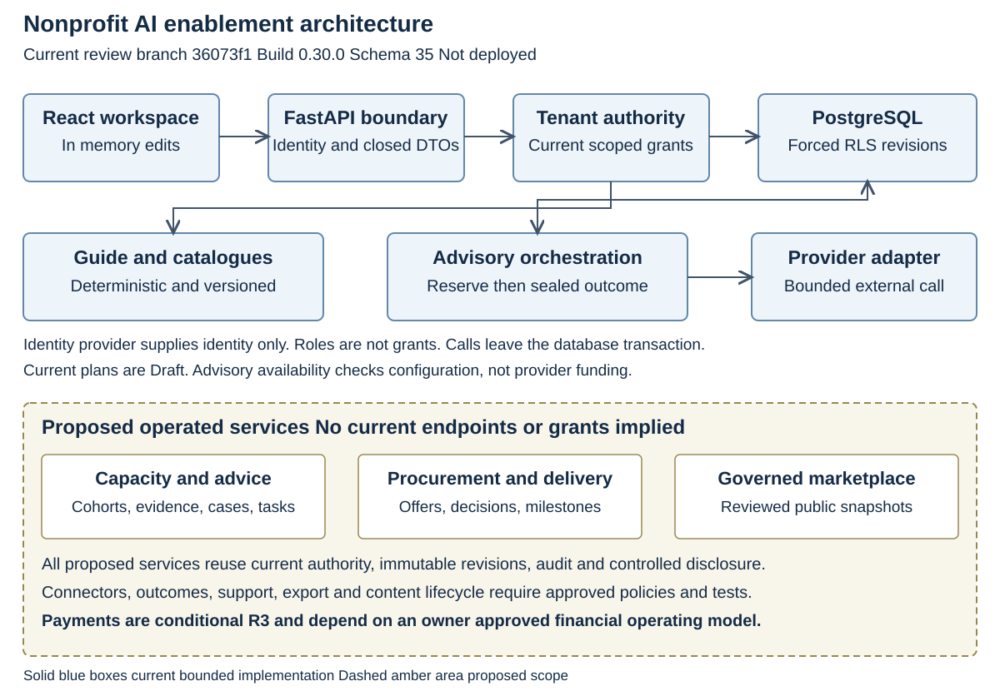
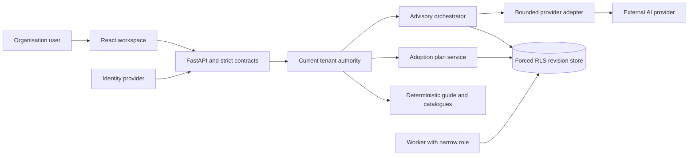

# Nonprofit AI Enablement Platform High Level Design

Edition 1.0  |  5 October 2026  |  Proposed baseline for owner review

## Design authority

This design derives from [the completed FSD](02-FSD.md), the BRD and requirements.json. Current means the code at review commit 36073f1, build 0.30.0, schema 35 and domain API 1.21.0. Target means proposed work requiring approved scope and policy before implementation. The branch is not merged or deployed. Original impact specifications and their 307 requirement acceptance ledger remain intact.

The product extends the existing governed impact application with AI adoption guidance, learning, discovery, procurement preparation and pilots. It subsequently adds operated learning, human advisory, supplier publication, procurement and delivery. The platform remains a modular application rather than introducing an independent marketplace infrastructure before an operating model is chosen. AI proposes; independent humans decide consequential actions and existing deterministic services produce official figures.

## Architecture principles and tradeoffs

Reuse the existing identity, tenant context, capability policy, immutable revision store, audit, outbox, receipt, evidence and worker components. This provides one consistent authority and transaction model and accelerates development. The tradeoff is contention at the tenant lock and a shared application release; mitigate with bounded transactions and measured load, rather than claiming unlimited scale.

Keep private tenant work separate from any eventual public catalogue. A current editorial catalogue is static code served only after tenant authorisation. A future public supplier snapshot contains independently approved fields and provenance; it is a projection, not unrestricted access to tenant supplier submissions. A marketplace operator and adviser never receive implicit tenant business access.

Separate stable planning from provider generation. Current assessment, catalogue, lessons and saved plans use no provider call. A provider request has a durable reservation before the external call and a separately committed outcome. This limits duplicate spending and database lock duration, but cannot promise exactly once generation across a provider call and database crash. An outcome without durable proof remains unknown and needs a controlled investigation.

Prefer additive objects and narrow projection tables over parallel mutable stores. New entities adopt tenant keys, forced RLS, exact revisions and atomic records. Cross organisation access uses explicit reviewed disclosure or a published snapshot rather than queries across private tenant rows. No approved evidence or report binding is overwritten.

## Current component boundaries

C-NPA-001 is the React product workspace. AIEnablement.tsx owns the profile, deterministic assessment and separately consented advisory action. AIAdoptionWorkspace.tsx owns discovery, bounded comparison, lessons, procurement notes, pilot actions and shared drafts. Existing navigation, shared Dialog and design tokens remain the interface foundation. The browser holds unsaved working state in memory; it does not store adoption plans or secrets in local storage.

C-NPA-002 is the API boundary in main.py. Existing authentication, origin and CSRF controls, correlation IDs, strict JSON handling, request limits, security headers and contract validation apply to the eight current AI enablement operations. The API performs current authorisation even if the UI hides an unavailable control. An unlisted future operation is not available by being drawn in a wireframe.

C-NPA-003 is tenant authority and storage context. auth.py resolves identity; store.context and store.authorize resolve active tenant, principal, membership, current capability, scope and relevant purpose or assurance. PostgreSQL connections use distinct runtime roles and transaction local tenant context. Forced RLS is an independent database fence, not a substitute for object and action authorisation.

C-NPA-004 is deterministic content and assessment. ai_enablement_catalog.py publishes editorial examples and assessment rules; ai_learning_content.py provides lessons; ai_solutions_catalog.py provides dated source backed product data. Versioned Python content is independent of user input. English keyword relevance is transparent and limited; it is not learned quality, price, competence or benefit ranking.

C-NPA-005 is adoption plan persistence. AIAdoptionPlans stores Draft objects through existing object_registry and object_revision with audit, outbox and operation_receipt in one transaction. The only schema 35 change adds the AIAdoptionPlan object kind. Scope filtered pagination and signed cursors avoid exposing hidden counts. The current plan is organisation working information and may be read by staff with the relevant scope.

C-NPA-006 is advisory orchestration. AIEnablement reserves an AIAdvisoryRequest and records a request row, audit and outbox under the tenant lock. Current quota is three requests per tenant in a rolling 24 hours, including failures. Provider results or a sanitised failure are recorded in the insert only ai_advisory_result table. Sealed successful results are bound to tenant and request and permit replay only for the original currently authorised principal.

C-NPA-007 is the provider adapter. OpenAIAdvisory sends only the submitted organisation profile and deterministic assessment with fixed instructions. It exposes no platform lookup tools. Requests use the server credential, configured model, store false request flag, bounded output, configured 45 second HTTP phase or inactivity timeouts and no automatic retries or redirects. Those timeouts do not enforce a hard overall deadline, and the flag does not establish the provider's full retention or contractual handling. The default model is a configuration choice, not a promise of availability. Catalog advisory_available signals enabled configuration, provider credential and sealing keys; it does not verify balance or model access.

C-NPA-008 is the shared worker and operational stack. The existing worker handles governed deliveries, report exports and retention jobs under generation fenced leases. The adoption tool currently makes synchronous provider calls and does not add an AI job class. Existing staging uses Caddy, API, worker, PostgreSQL, Keycloak and evidence storage in Docker Compose on one server. New task or connector job classes are proposals and need their own narrow grants and qualified leases.

## Current interaction overview

Figure interpretation: user and provider data are untrusted at the application boundary. Plans and advisory claims share the governed database fence. Only the advisory adapter crosses the AI provider boundary; the guide and plan service do not. The worker does not read arbitrary private AI drafts merely because it handles other tenant jobs.

## Trust boundaries and data flows

The first boundary is browser to API. The browser is not an authority source; it can only select an object and submit bounded input. Cookie mutations require current session, same origin and CSRF validation. Bearer identity receives no powers from provider role claims. Avoid sensitive input in logs, URLs or browser storage and render generated or supplier text without executable markup.

The second boundary is API to identity and control plane. Identity proves an account, not membership, delegation or procurement authority. Tenant administrators grant only inside reviewed ceilings. The control plane changes custody and authority through narrow governed operations and distinct database role restrictions. A profile update cannot silently expand applied ceilings; pending requests pinned to an old profile hash require re proposal.

The third boundary is API to tenant persistence. Every tenant table includes tenant_id in primary and foreign keys and uses ENABLE and FORCE ROW LEVEL SECURITY with tenant_fence. Set impact.tenant_id locally before access and use non owner, non BYPASSRLS connections. A tenant lock precedes write authority resolution; operation locks follow that tenant lock. Head, revision, audit, outbox and receipt commit atomically for plan mutations. Missing or hidden objects have the same refusal.

The fourth boundary is provider disclosure. A current advisory user expressly consents to the submitted profile leaving the system. No protected programme, observation, evidence or beneficiary records are joined. The sensitivity flag is a warning rather than a classifier or sanitiser. The first pilot uses synthetic material and excludes beneficiary personal data. A future task template requires an explicit input boundary, approved provider destination and budget reservation before calling an adapter.

The fifth proposed boundary is marketplace and human service disclosure. A supplier or adviser sees an exact reviewed case or RFQ revision and its permitted attachments. Review also pins recipients, purpose and expiry; any broader audience or changed evidence needs a new disclosure decision. Global listing readers see only independently approved public snapshot fields. No operator can enumerate private tenant work to populate a public marketplace.

## Critical current sequences

A plan save validates its command shape, enters a tenant transaction, takes the tenant advisory lock, resolves current write context and both read and manage authority, takes the operation lock and checks the actor and command receipt. An exact existing request rechecks access to the original plan and replays its receipt. A new write loads the head under lock, refuses a stale expected revision, validates semantic fields and the tenant plan ceiling, adds current content version strings and writes all governed components. The client retains newer edits if an older save finishes.

A current advisory request validates consent and profile, computes deterministic assessment and fingerprints only the submitted body. Under the tenant lock it checks read and request authority and prior reservation. A completed exact request replays its sealed result or stored failure. A reservation without result returns in flight. A new request checks configuration and the rolling quota and commits the claim. It then calls the provider without an open database transaction. The outcome transaction takes the tenant lock and rechecks current authority before adding exactly one sealed result or failure and audit/outbox. Loss of authority or a crash before this outcome leaves an unresolved reservation; no automatic second call is made.

Content retrieval resolves current tenant authority before serving code based catalogues. Content changes are tied to a deployment commit. Plan saves pin version strings, but the current application has no historical catalogue retrieval service. Preserving old lesson key meaning and publishing retained snapshots are future content governance controls.

## Proposed functional components

C-NPA-009 is learning operations for LearningProgramme, Cohort, LearningAssignment and CompetencyAssessment. It pins stable content and rubrics, restricts evidence sharing and records assessor decisions. Self reported lesson completion remains separate from reviewed competency. DEC-NPA-008 determines standard and independence policy before implementation.

C-NPA-010 is human advisory and task work. HumanAdvisoryCase records restricted parties, scope, conflicts and closure. TaskTemplate and TaskRun pin approved purpose, input and output checks. They reuse orchestration but do not grant model supplied actions or access to hidden records. Model or adviser output cannot approve procurement, publish a report or deploy an integration.

C-NPA-011 is procurement. ProcurementRequest, SupplierQuote, CostComparison and ProcurementDecision preserve exact briefs, offers, dated assumptions and independently reviewed decisions. Deterministic costing uses decimal strings and declared currency. Approved disclosures create outbox intents, and adapter receipts or reconciled evidence prove actual delivery. Policies and amount thresholds await DEC-NPA-007.

C-NPA-012 is supplier governance. SupplierSubmission and PublishedSupplierSnapshot separate private onboarding from approved public publication. Verification scope, evidence, expiry and commercial relationship are visible. Material updates and wider public fields require another review. Neutral placement and commercial policy await DEC-NPA-004 and DEC-NPA-005.

C-NPA-013 is engagement and delivery. Engagement and DeliveryMilestone pin agreed terms, scope, acceptance tests and exact evidence. The accepting natural person is independent of material authors. Changes to accepted evidence produce a new version. Booking and delivery are distinct from purchasing or payment.

C-NPA-014 is connectors and usage governance. ConnectorBinding defines approved minimal scopes, destination and server secret reference. Synthetic trial precedes an Active state. A reviewed policy reserves bounded spend before provider work, records usage and reconciles uncertain outcomes; connector revocation and incident pause prevent new calls. These controls extend current attempt quota rather than claiming a monetary limit already exists.

C-NPA-015 is outcomes, support and feedback. AdoptionOutcome carries comparable baseline and outcome evidence, SupportCase restricts incident evidence and ownership, and FeedbackRecord captures optional minimised feedback. Aggregation does not silently train a model on private records. Outcomes link governed impact snapshots rather than replacing official figures.

C-NPA-016 is portability and lifecycle. A future export service requires separate export capability, exact scope, immutable package references and audited delivery. Privacy inventory includes every new table, object, sealed store, job result, export and backup replay obligation. Current insert only advisory tables need a reviewed migration for any controlled lifecycle change.

C-NPA-017 is conditional financial integration. Purchase and PaymentAttempt are unavailable until the operator, payment model, approval, reconciliation and refund responsibilities are approved under DEC-NPA-015. Design the ledger and financial adapter only after this choice. No settlement service, tax treatment, fee rate or customer funds custody is assumed.

C-NPA-018 is content governance and interoperability. Versioned publication retains original lesson meanings and supplier claim provenance. Reuse registers identify imported code versus adapted workflow patterns and preserve licences. Existing approved logframe export and arithmetic/calendar regression scenarios from Mercy Corps remain the concrete baseline; MSME supplies a journey pattern, not financial policy or factory data.

## Requirement allocation

| Component | Functional requirements |
|---|---|
| C-NPA-001 Product workspace | FR-NPA-001, FR-NPA-005, FR-NPA-006, FR-NPA-007, FR-NPA-013, FR-NPA-021, FR-NPA-028 |
| C-NPA-002 API boundary | FR-NPA-025, FR-NPA-027, FR-NPA-037, FR-NPA-039 |
| C-NPA-003 Authority and context | FR-NPA-025, FR-NPA-026, FR-NPA-033, FR-NPA-035, FR-NPA-039 |
| C-NPA-004 Deterministic guide | FR-NPA-002, FR-NPA-003, FR-NPA-004, FR-NPA-007, FR-NPA-038 |
| C-NPA-005 Plan persistence | FR-NPA-001, FR-NPA-006, FR-NPA-013, FR-NPA-021, FR-NPA-027, FR-NPA-037, FR-NPA-039 |
| C-NPA-006 Advisory orchestration | FR-NPA-010, FR-NPA-023, FR-NPA-026, FR-NPA-029, FR-NPA-035, FR-NPA-039 |
| C-NPA-007 Provider adapter | FR-NPA-010, FR-NPA-023, FR-NPA-026, FR-NPA-029 |
| C-NPA-008 Worker and operations | FR-NPA-029, FR-NPA-033, FR-NPA-040 |
| C-NPA-009 Learning operations | FR-NPA-008, FR-NPA-009 |
| C-NPA-010 Advisory and workbench | FR-NPA-011, FR-NPA-012, FR-NPA-035 |
| C-NPA-011 Procurement | FR-NPA-014, FR-NPA-015, FR-NPA-016 |
| C-NPA-012 Supplier governance | FR-NPA-017, FR-NPA-018 |
| C-NPA-013 Engagement and delivery | FR-NPA-019, FR-NPA-021 |
| C-NPA-014 Connectors and usage | FR-NPA-022, FR-NPA-023 |
| C-NPA-015 Outcomes and support | FR-NPA-024, FR-NPA-032, FR-NPA-034 |
| C-NPA-016 Portability and lifecycle | FR-NPA-026, FR-NPA-030 |
| C-NPA-017 Conditional finance | FR-NPA-020 |
| C-NPA-018 Content and reuse | FR-NPA-031, FR-NPA-036, FR-NPA-038 |

Each component inherits isolation, validation, current authority, audit and human control. Allocation does not mean implementation; current components are grounded in code and proposed components remain designs.

## Persistence and consistency

PostgreSQL remains the system of record. Current plans reuse registry and revision rows rather than adding a dedicated plan table. Advisory request and result tables added by migration 0034 carry composite tenant keys, foreign keys, forced fences and insert only triggers; schema 0035 extends the object kind constraint while preserving existing kinds. Version strings in a plan are metadata, not archived content bytes.

For target objects, use registry revisions for business payload and narrow immutable projection registers for decisions, exact bindings or delivery proof. Approvals cannot update a pinned original, and a projection must not bypass parent scope. Use an outbox for deferred external work, with a consumer receipt or verified external evidence for outcome. Target workers need a job specific lease generation fence and database time; no newly proposed worker role may receive broad table read grants.

An eventually refreshed list or dashboard can lag a committed mutation, but a receipt proves the mutation's own transaction, not delivery or external acceptance. Do not expose total hidden row counts. Cost and outcome calculations use declared decimal precision, input versions and completeness; official impact results retain existing numeric and snapshot semantics.

## Failure and recovery design

Database refusal rolls back the full current plan mutation. The client can retry the identical operation while the receipt is valid and current authority remains. Stale revisions and changed payloads are semantic conflicts requiring a person to reconcile, not background automatic retries.

Provider disabled, unavailable, timeout, refusal or exhausted credits produces explicit bounded failure. A stored failure is replayed rather than consuming another provider request under the same ID. If a claim exists without outcome, operational investigation must identify request, tenant, actor, time and available provider evidence without exposing prompt or secret; current code has no operator resolution endpoint. A richer recovery design cannot simply clear the claim and regenerate.

Identity provider unavailability follows the existing fail closed identity rules. Connector and supplier delivery failures must not roll back an already committed decision or invent proof of delivery. Use visible pending, failed or unknown outcome states and controlled reconciliation. Exports and other background effects are fenced against stale workers.

Retention and sealing keys must be governed together. Retiring a key needed to unseal retained advice makes that result unreadable; decide retention and key grace or re sealing under reviewed procedures before general use. Single server backups and existing restore drills do not establish approved recovery objectives or immutable off server protection. New entities need restore tests including deletion and revocation replay before access reopens.

## Deployment capacity and observability

The current extension deploys through the existing application and schema migration path after four hosted jobs and owner confirmation. It creates no new infrastructure service. Provider feature activation, server secrets and funded access are separate operational steps. Existing tenants require reviewed capability ceilings; do not assume newly generated onboarding bundles grant the new functions to organisations already active.

Current tenant serialisation, 1000 plan ceiling, list limit of 100, four solution selection limit and bounded external requests reduce load but are not a concurrency capacity qualification. Measure request latency, tenant fairness, lock waits, reservation volume and provider time before deciding on connection pool, asynchronous job class or service split. Proposed SLO and capacity targets await DEC-NPA-010; provider budget thresholds await DEC-NPA-011.

Operational telemetry records request correlation, route family, status class, latency, database or provider failure class, unresolved reservations, worker lease health and delivery outcomes without profile, generated text, credential or personal content. Tenant usage visibility must itself require current scope. Set alert owners and response expectations before rollout; no numeric thresholds or response times are invented here.

## Qualification and remaining design gates

The recorded local run has 1101 passes, seven unchanged Mac operations failures, 76 skips and one deselection, with ten local browser scenarios. These are bounded implementation evidence, not native concurrency or hosted release qualification. Automated accessibility scans include incomplete items requiring manual verification. Qualify the candidate through local reference and Linux browser, live identity provider, native PostgreSQL roles and concurrency, and container deployment path. Confirm migrations on a populated database and restore the new tables under real runtime roles.

BRD decisions on cohort, task acceptance, permitted data, commercial operator, verification, advisers, procurement, competency, retention, service levels, provider budget, content versions, access ceilings, connectors, finance and outcome evidence remain open. [The LLD](04-LLD.md) supplies exact current interfaces and proposed implementation blueprints. Test and UX documents add traceable verification and field definitions. Approval of this design is recorded by a human before target implementation; a diagram or component allocation does not close a business requirement.
